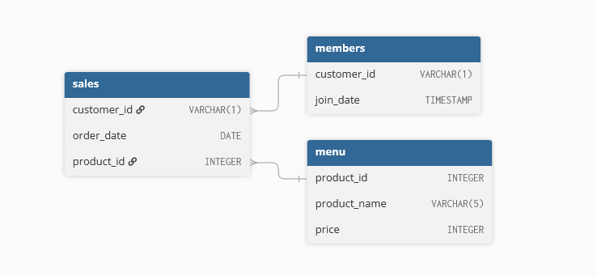

# Danny's Diner

## Source

https://8weeksqlchallenge.com/case-study-1/

## Concepts learned

* Joining back information on some kind of metric (in this case a minimal order date).
* Grouping by multiple columns at the same time to get all the rows in a table where the combinations of those columns are different.
* Working with CTEs (Common Table Expressions) to create readable pipelines for the code rather than making one big SELECT statement.
* Using CASE WHEN statements as an analogue to IF-THEN programming logic.
* First taste of window functions via use of the RANK function.

## Introduction

Danny seriously loves Japanese food so in the beginning of 2021, he decides to embark upon a risky venture and opens up a cute little restaurant that sells his 3 favourite foods: sushi, curry and ramen.

Danny’s Diner is in need of your assistance to help the restaurant stay afloat - the restaurant has captured some very basic data from their few months of operation but have no idea how to use their data to help them run the business.

## Problem Statement

Danny wants to use the data to answer a few simple questions about his customers, especially about their visiting patterns, how much money they’ve spent and also which menu items are their favourite. Having this deeper connection with his customers will help him deliver a better and more personalised experience for his loyal customers.

He plans on using these insights to help him decide whether he should expand the existing customer loyalty program - additionally he needs help to generate some basic datasets so his team can easily inspect the data without needing to use SQL.

## Datasets

This case study contains 3 tables.

### **Table 1: sales**

The `sales` table captures all `customer_id` level purchases with the corresponding `order_date` and `product_id` information for when and what menu items were ordered.

| customer\_id | order\_date | product\_id |
| :---: | :---: | :---: |
| A | 2021-01-01 | 1 |
| A | 2021-01-01 | 2 |
| A | 2021-01-07 | 2 |
| A | 2021-01-10 | 3 |
| A | 2021-01-11 | 3 |
| A | 2021-01-11 | 3 |
| B | 2021-01-01 | 2 |
| B | 2021-01-02 | 2 |
| B | 2021-01-04 | 1 |
| B | 2021-01-11 | 1 |
| B | 2021-01-16 | 3 |
| B | 2021-02-01 | 3 |
| C | 2021-01-01 | 3 |
| C | 2021-01-01 | 3 |
| C | 2021-01-07 | 3 |

### **Table 2: menu**

The `menu` table maps the `product_id` to the actual `product_name` and `price` of each menu item.

| product\_id | product\_name | price |
| ----- | ----- | ----- |
| 1 | sushi | 10 |
| 2 | curry | 15 |
| 3 | ramen | 12 |

### **Table 3: members**

The final `members` table captures the `join_date` when a `customer_id` joined the beta version of the Danny’s Diner loyalty program.

| customer\_id | join\_date |
| ----- | ----- |
| A | 2021-01-07 |
| B | 2021-01-09 |

## Entity Relationship Diagram

