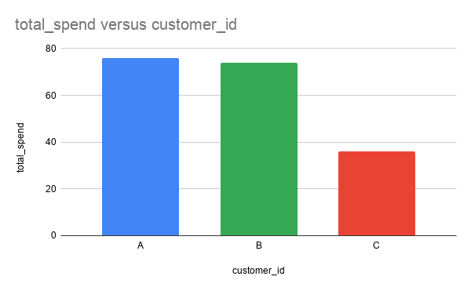

# Danny’s Diner

https://8weeksqlchallenge.com/case-study-1/

Queries written in (DB browser for) SQlite.

# Case study questions and answers

1. *What is the total amount each customer spent at the restaurant?*

**Query:**

```sql
SELECT customer_id, SUM(price) as total_spend
FROM sales
JOIN menu ON sales.product_id = menu.product_id
GROUP BY customer_id
```

**Result:**

| **customer_id** | **total_spend** |
| --------------- | --------------- |
| A               | 76              |
| B               | 74              |
| C               | 36              |

**(Optional) Google Sheets graph:**



2. *How many days has each customer visited the restaurant?*

**Query:**

```sql
SELECT customer_id, COUNT( DISTINCT order_date) AS days_visited
FROM sales
GROUP BY customer_id
```

**Result:**

| **customer_id** | **days_visited** |
| --------------- | ---------------- |
| A               | 4                |
| B               | 6                |
| C               | 2                |

3. *What was the first item from the menu purchased by each customer?*

**Query:**

```sql
SELECT DISTINCT sales.customer_id, menu.product_name AS first_order
FROM sales
JOIN menu ON sales.product_id = menu.product_id
JOIN ( 
    SELECT customer_id, MIN(order_date) AS first_order_date
    FROM sales
    GROUP BY customer_id
) AS first_orders 
ON sales.customer_id = first_orders.customer_id 
AND sales.order_date = first_orders.first_order_date
```

**Result:**

| **customer_id** | **first_order** |
| --------------- | --------------- |
| A               | sushi           |
| A               | curry           |
| B               | curry           |
| C               | ramen           |

**Learned:**

Using a subquery to get the “first_order”s first and then **joining back** the information by joining on both the “customer_id” and the “order_date” at the same time.

4. *What is the most purchased item on the menu and how many times was it purchased by all customers?*

**Query:**

```sql
SELECT product_name, COUNT(*) AS total_purchases
FROM sales
JOIN menu ON sales.product_id = menu.product_id
GROUP BY product_name
ORDER BY total_purchases DESC
LIMIT 1
```

**Result:**

| **product_name** | **total_purchases** |
| ---------------- | ------------------- |
| ramen            | 8                   |

5. *Which item was the most popular for each customer?*

**Query:**

```sql
WITH counts AS (
    SELECT customer_id, menu.product_name AS products, COUNT(*) AS amount
    FROM sales 
    JOIN menu ON sales.product_id = menu.product_id
    GROUP BY customer_id, menu.product_id
),
max_counts AS (
    SELECT customer_id, MAX(amount) AS max_amount
    FROM counts
    GROUP BY customer_id
)
SELECT counts.customer_id, products AS most_popular_item
FROM counts
JOIN max_counts ON counts.customer_id = max_counts.customer_id 
AND max_amount = amount
```

**Result:**

| **customer_id** | **most_popular_item** |
| --------------- | --------------------- |
| A               | ramen                 |
| B               | sushi                 |
| B               | curry                 |
| B               | ramen                 |
| C               | ramen                 |

**Learned:**

* **Grouping by two columns at the same time** to get the aggregate COUNT of every item per customer.
* Using **CTEs** to deal with dependence: the “max_counts” table needs the “counts” table to be constructed and so the WITH clause is used so that we can have both tables side to side. We then join back both tables to get all the required information in one table.

6. *Which item was purchased first by the customer after they became a member?*

**Query:**

```sql
WITH first_order_date AS (
    SELECT customer_id, MIN(order_date) AS first_date
    FROM sales
    JOIN members USING (customer_id)
    WHERE join_date <= order_date
    GROUP BY customer_id
),
sales_names AS (
    SELECT customer_id, order_date, menu.product_name
    FROM sales
    JOIN menu USING (product_id)
)
SELECT sales_names.customer_id, sales_names.product_name AS first_purchase
FROM sales_names
JOIN first_order_date ON first_order_date.customer_id = sales_names.customer_id
AND first_date = sales_names.order_date
```

**Result:**

| **customer_id** | **first_purchase** |
| --------------- | ------------------ |
| A               | curry              |
| B               | sushi              |

**Learned:**

**USING** keyword to join two tables on an identically named column as a shortcut.

7. *Which item was purchased just before the customer became a member?*

**Query:**

```sql
WITH last_order_date AS (
    SELECT customer_id, MAX(order_date) AS last_date
    FROM sales
    JOIN members USING (customer_id)
    WHERE join_date > order_date
    GROUP BY customer_id
),
sales_names AS (
    SELECT customer_id, order_date, menu.product_name
    FROM sales
    JOIN menu USING (product_id)
)
SELECT sales_names.customer_id, sales_names.product_name AS purchase
FROM sales_names
JOIN last_order_date ON last_order_date.customer_id = sales_names.customer_id
AND last_date = sales_names.order_date
```

**Result:**

| **customer_id** | **purchase** |
| --------------- | ------------ |
| A               | sushi        |
| A               | curry        |
| B               | sushi        |

8. *What is the total items and amount spent for each member before they became a member?*

**Query:**

```sql
SELECT customer_id, COUNT(*) AS total_items, SUM(menu.price) AS amount_spent
FROM sales
JOIN members USING (customer_id)
JOIN menu USING (product_id)
WHERE join_date > order_date
GROUP BY customer_id
```

**Result:**

| **customer_id** | **total_items** | **amount_spent** |
| --------------- | --------------- | ---------------- |
| A               | 2               | 25               |
| B               | 3               | 40               |

9. *If each $1 spent equates to 10 points and sushi has a 2x points multiplier - how many points would each customer have?*

**Query:**

```sql
SELECT customer_id, SUM(CASE WHEN menu.product_name = "sushi" THEN 20 * price ELSE 10 * price END) AS total_points
FROM sales
JOIN menu USING (product_id)
GROUP BY customer_id
```

**Result:**

| **customer_id** | **total_points** |
| --------------- | ---------------- |
| A               | 860              |
| B               | 940              |
| C               | 360              |

**Note:**

I’ve assumed from the way the question is worded that customer C gains points as well, even though they’ve never joined the loyalty program.

**Learned:**

Using **CASE WHEN** statement as IF-THEN programming logic to more easily differentiate between sushi (which gets 2x multiplier) and the other dishes.

Using a WHERE statement ran into the problem of removing customer rows that did not buy a certain dish. Specifically here customer C never buys sushi, so they would get no “sushi points” and in the sushi points table I made for that, the row with customer C would be absent which leads to problems when trying to join back the tables later.

Possibly this could be solved with UNIONs if you can keep track of what rows become NULL/get lost in grouping, but the CASE WHEN solution seems a lot simpler and efficient.

10. *In the first week after a customer joins the program (including their join date) they earn 2x points on all items, not just sushi - how many points do customer A and B have at the end of January?*

**Query:**

```sql
SELECT customer_id, SUM(CASE 
    WHEN product_name = "sushi" THEN 20 * price
    WHEN order_date - members.join_date <= 7 AND order_date - members.join_date >= 0 THEN 20 * price 
    ELSE 10 * price END) AS total_points
FROM sales
JOIN menu USING (product_id)
JOIN members USING (customer_id)
WHERE order_date < "2021-02-01" AND order_date >= "2021-01-01"
GROUP BY customer_id
```

**Result:**

| **customer_id** | **total_points** |
| --------------- | ---------------- |
| A               | 1520             |
| B               | 1240             |

**Note:**

Once again I assume that customers get points before joining the loyalty program too, just like customer C in question 9 got points even though they aren’t a member.

If the intended interpretation was that points are *only awarded after joining the program*, then I would add an extra case to the CASE WHEN statement that checks at the start if the “order_date” is smaller than or equal to the “join_date” (signifying non-membership), in which case the returned value should be 0 points.

# Bonus:

## Join All The Things

**Query:**

```sql
SELECT customer_id, order_date, menu.product_name, menu.price, 
CASE 
    WHEN order_date >= members.join_date THEN "Y" ELSE "N"
END AS member
FROM sales
JOIN menu USING (product_id)
LEFT JOIN members USING (customer_id)
ORDER BY customer_id, order_date, product_name
```

**Result:**

| **customer_id** | **order_date** | **product_name** | **price** | **member** |
| --------------- | -------------- | ---------------- | --------- | ---------- |
| A               | 2021-01-01     | curry            | 15        | N          |
| A               | 2021-01-01     | sushi            | 10        | N          |
| A               | 2021-01-07     | curry            | 15        | Y          |
| A               | 2021-01-10     | ramen            | 12        | Y          |
| A               | 2021-01-11     | ramen            | 12        | Y          |
| A               | 2021-01-11     | ramen            | 12        | Y          |
| B               | 2021-01-01     | curry            | 15        | N          |
| B               | 2021-01-02     | curry            | 15        | N          |
| B               | 2021-01-04     | sushi            | 10        | N          |
| B               | 2021-01-11     | sushi            | 10        | Y          |
| B               | 2021-01-16     | ramen            | 12        | Y          |
| B               | 2021-02-01     | ramen            | 12        | Y          |
| C               | 2021-01-01     | ramen            | 12        | N          |
| C               | 2021-01-01     | ramen            | 12        | N          |
| C               | 2021-01-07     | ramen            | 12        | N          |

**Notes:**

* LEFT JOIN members so as to not throw away the non-members (customer C).
* Order by “customer_id”, “order_date” and “product_name” since the original table we want to recreate has this specific order (only the top two rows are switched around by this).

## Rank All The Things

**Query:**

```sql
WITH join_all AS (
    SELECT customer_id, order_date, menu.product_name, menu.price, 
    CASE 
        WHEN order_date >= members.join_date THEN "Y" ELSE "N"
    END AS member
    FROM sales
    JOIN menu USING (product_id)
    LEFT JOIN members USING (customer_id)
    ORDER BY customer_id, order_date, product_name
)
SELECT *, 
    CASE
        WHEN member = "Y" THEN RANK() OVER(PARTITION BY customer_id, member ORDER BY order_date)
        ELSE NULL
    END AS ranking
FROM join_all
```

**Result:**

| **customer_id** | **order_date** | **product_name** | **price** | **member** | **ranking** |
| --------------- | -------------- | ---------------- | --------- | ---------- | ----------- |
| A               | 2021-01-01     | curry            | 15        | N          | null        |
| A               | 2021-01-01     | sushi            | 10        | N          | null        |
| A               | 2021-01-07     | curry            | 15        | Y          | 1           |
| A               | 2021-01-10     | ramen            | 12        | Y          | 2           |
| A               | 2021-01-11     | ramen            | 12        | Y          | 3           |
| A               | 2021-01-11     | ramen            | 12        | Y          | 3           |
| B               | 2021-01-01     | curry            | 15        | N          | null        |
| B               | 2021-01-02     | curry            | 15        | N          | null        |
| B               | 2021-01-04     | sushi            | 10        | N          | null        |
| B               | 2021-01-11     | sushi            | 10        | Y          | 1           |
| B               | 2021-01-16     | ramen            | 12        | Y          | 2           |
| B               | 2021-02-01     | ramen            | 12        | Y          | 3           |
| C               | 2021-01-01     | ramen            | 12        | N          | null        |
| C               | 2021-01-01     | ramen            | 12        | N          | null        |
| C               | 2021-01-07     | ramen            | 12        | N          | null        |

**Learned:**

**Window function RANK** usage, and having to choose between a CTE or repeating the condition for membership because in “join_all” I cannot call “member” in the same SELECT statement that member is instantiated. Nesting the same logic again in a single SELECT statement seemed hard to read.

At first I tried to write a ranking table that I would then join back later on the join_all table. But because of these duplicate rows in both tables

| A | 2021-01-11 | ramen | 12 | Y | 3 |
| - | ---------- | ----- | -- | - | - |
| A | 2021-01-11 | ramen | 12 | Y | 3 |

joining them at the end would lead to 2 x 2 = 4 rows. I couldn’t just group these rows at the end, since the final result required both of these rows to stay intact.
