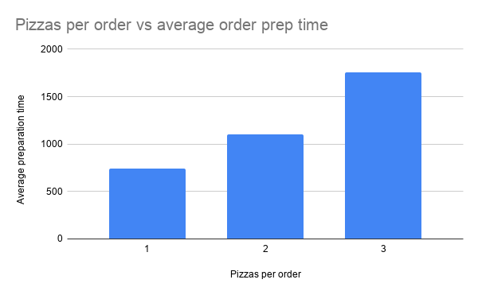
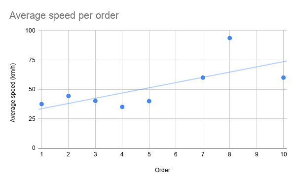
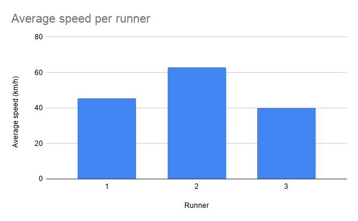

# Pizza Runner

https://8weeksqlchallenge.com/case-study-2/

Queries written in (DB browser for) SQlite.

# Data cleaning

<details>
<summary> Click to expand answer! </summary>

The “customer_orders” and “runner_orders” tables have a lot of different ways to denote empty cells, and we would first like to homogenize the columns so that querying will be easier later on. The “runner_orders” table also has some incorrect dates (pickup times in the year 2020, when the runners themselves register in 2021), as well as inconsistent distance and duration notations. We will also make these consistent by removing the letters and only keeping the amount of kilometers or the amount of minutes.

**Current customer_orders table:**

| **order_id** | **customer_id** | **pizza_id** | **exclusions** | **extras** | **order_time**      |
| ------------ | --------------- | ------------ | -------------- | ---------- | ------------------- |
| 1            | 101             | 1            |                |            | 2021-01-01 18:05:02 |
| 2            | 101             | 1            |                |            | 2021-01-01 19:00:52 |
| 3            | 102             | 1            |                |            | 2021-01-02 23:51:23 |
| 4            | 103             | 1            | 4              |            | 2021-01-04 13:23:46 |
| 4            | 103             | 1            | 4              |            | 2021-01-04 13:23:46 |
| 5            | 104             | 1            | null           | 1          | 2021-01-08 21:00:29 |
| 8            | 102             | 1            | null           | null       | 2021-01-09 23:54:33 |
| 9            | 103             | 1            | 4              | 1, 5       | 2021-01-10 11:22:59 |
| 10           | 104             | 1            | null           | null       | 2021-01-11 18:34:49 |
| 10           | 104             | 1            | 2, 6           | 1, 4       | 2021-01-11 18:34:49 |
| 3            | 102             | 2            |                |            | 2021-01-02 23:51:23 |
| 4            | 103             | 2            | 4              |            | 2021-01-04 13:23:46 |
| 6            | 101             | 2            | null           | null       | 2021-01-08 21:03:13 |
| 7            | 105             | 2            | null           | 1          | 2021-01-08 21:20:29 |

**Current runner_orders table:**

| **order_id** | **runner_id** | **pickup_time**     | **distance** | **duration** | **cancellation**        |
| ------------ | ------------- | ------------------- | ------------ | ------------ | ----------------------- |
| 1            | 1             | 2021-01-01 18:15:34 | 20km         | 32 minutes   |                         |
| 2            | 1             | 2021-01-01 19:10:54 | 20km         | 27 minutes   |                         |
| 3            | 1             | 2021-01-03 00:12:37 | 13.4km       | 20 mins      |                         |
| 4            | 2             | 2021-01-04 13:53:03 | 23.4         | 40           |                         |
| 5            | 3             | 2021-01-08 21:10:57 | 10           | 15           |                         |
| 6            | 3             | null                | null         | null         | Restaurant Cancellation |
| 7            | 2             | 2020-01-08 21:30:45 | 25km         | 25 mins      | null                    |
| 8            | 2             | 2020-01-10 00:15:02 | 23.4 km      | 15 minute    | null                    |
| 9            | 2             | null                | null         | null         | Customer Cancellation   |
| 10           | 1             | 2020-01-11 18:50:20 | 10km         | 10 minutes   | null                    |

**Data cleaning query:**

```sql
UPDATE runner_orders
SET pickup_time = NULL
WHERE pickup_time = "null";

UPDATE runner_orders
SET distance = NULL
WHERE distance = "null";

UPDATE runner_orders
SET distance = CAST(TRIM(REPLACE(distance, "km", "")) AS REAL);
--(future comment): TRIM was probably unnecessary if cast as REAL anyway

UPDATE runner_orders
SET duration = NULL
WHERE duration = "null";

UPDATE runner_orders
SET duration = CAST(TRIM(REPLACE(duration, "%min%", "")) AS INTEGER);
--(future comment): Same deal as above

UPDATE runner_orders
SET cancellation = NULL
WHERE cancellation IN ("null", "");

UPDATE runner_orders
SET pickup_time = REPLACE(pickup_time, '2020', '2021');

UPDATE customer_orders
SET exclusions = NULL
WHERE exclusions IN ("null", "");

UPDATE customer_orders
SET extras = NULL
WHERE extras IN ("null", "");
```

**Cleaned customer_orders table:**

| **order_id** | **customer_id** | **pizza_id** | **exclusions** | **extras** | **order_time**      |
| ------------ | --------------- | ------------ | -------------- | ---------- | ------------------- |
| 1            | 101             | 1            |                |            | 2021-01-01 18:05:02 |
| 2            | 101             | 1            |                |            | 2021-01-01 19:00:52 |
| 3            | 102             | 1            |                |            | 2021-01-02 23:51:23 |
| 3            | 102             | 2            |                |            | 2021-01-02 23:51:23 |
| 4            | 103             | 1            | 4              |            | 2021-01-04 13:23:46 |
| 4            | 103             | 1            | 4              |            | 2021-01-04 13:23:46 |
| 4            | 103             | 2            | 4              |            | 2021-01-04 13:23:46 |
| 5            | 104             | 1            |                | 1          | 2021-01-08 21:00:29 |
| 6            | 101             | 2            |                |            | 2021-01-08 21:03:13 |
| 7            | 105             | 2            |                | 1          | 2021-01-08 21:20:29 |
| 8            | 102             | 1            |                |            | 2021-01-09 23:54:33 |
| 9            | 103             | 1            | 4              | 1, 5       | 2021-01-10 11:22:59 |
| 10           | 104             | 1            |                |            | 2021-01-11 18:34:49 |
| 10           | 104             | 1            | 2, 6           | 1, 4       | 2021-01-11 18:34:49 |

**Cleaned runner_orders table:**

| **order_id** | **runner_id** | **pickup_time**     | **distance** | **duration** | **cancellation**        |
| ------------ | ------------- | ------------------- | ------------ | ------------ | ----------------------- |
| 1            | 1             | 2021-01-01 18:15:34 | 20.0         | 32           |                         |
| 2            | 1             | 2021-01-01 19:10:54 | 20.0         | 27           |                         |
| 3            | 1             | 2021-01-03 00:12:37 | 13.4         | 20           |                         |
| 4            | 2             | 2021-01-04 13:53:03 | 23.4         | 40           |                         |
| 5            | 3             | 2021-01-08 21:10:57 | 10.0         | 15           |                         |
| 6            | 3             |                     |              |              | Restaurant Cancellation |
| 7            | 2             | 2020-01-08 21:30:45 | 25.0         | 25           |                         |
| 8            | 2             | 2020-01-10 00:15:02 | 23.4         | 15           |                         |
| 9            | 2             |                     |              |              | Customer Cancellation   |
| 10           | 1             | 2020-01-11 18:50:20 | 10.0         | 10           |                         |

**Note:**

The distance and duration values from “runner_orders” were recast as REAL and INTEGER respectively, to set up future aggregate analysis with these values.

The current “pizza_recipes” table contains a list of values in the column “toppings”:

| **pizza id** | **toppings**            |
| ------------ | ----------------------- |
| 1            | 1, 2, 3, 4, 5, 6, 8, 10 |
| 2            | 4, 6, 7, 9, 11, 12      |

This is problematic when we want to e.g. JOIN this table to another table later. Therefore, this time we create a new clean table that splits the values from the strings over multiple rows using a recursive CTE.

**Query:**

```sql
CREATE TABLE pizza_recipes_clean AS
WITH RECURSIVE clean_recipes AS (
    --Base case
    SELECT 
        pizza_id,
        CASE 
            WHEN instr(toppings, ',') = 0 THEN CAST(toppings AS INTEGER) --Check if we have more than one number in the list
            ELSE 
                CAST(
                    substr(toppings, 1, instr(toppings, ',') - 1) --Take the first digits before the first comma
                AS INTEGER) --The remaining number is a string, so we cast it into an integer
        END AS topping,
        CASE
            WHEN instr(toppings, ',') = 0 THEN NULL --Nothing remains
            ELSE substr(toppings, instr(toppings, ',') + 1) --Let everything after the comma remain for the next recursive loop
        END AS remaining
    FROM pizza_recipes
    
    --Recursive step
    UNION ALL
    
    SELECT 
        pizza_id,
        CASE 
            WHEN instr(remaining, ',') = 0 THEN CAST(remaining AS INTEGER) --Same as base case, but continuing from “remaining”
            ELSE 
                CAST(
                    substr(remaining, 1, instr(remaining, ',') - 1)
                AS INTEGER)
        END AS topping,
        CASE 
            WHEN instr(remaining, ',') = 0 THEN NULL
            ELSE substr(remaining, instr(remaining, ',') + 1) 
        END AS remaining
    FROM clean_recipes --Recursion, calling itself
    WHERE remaining IS NOT NULL --Ends recursion
)
SELECT pizza_id, topping
FROM clean_recipes
```

**Result (after a quick sort):**

**Pizza_recipes_clean:**

| **pizza_id** | **topping** |
| ------------ | ----------- |
| 1            | 1           |
| 1            | 2           |
| 1            | 3           |
| 1            | 4           |
| 1            | 5           |
| 1            | 6           |
| 1            | 8           |
| 1            | 10          |
| 2            | 4           |
| 2            | 6           |
| 2            | 7           |
| 2            | 9           |
| 2            | 11          |
| 2            | 12          |

**Note 2:**

The “customer_orders” table still has a problem. The exclusions and extras columns are also lists, so we have the same problem as before. We cannot just apply recursion again directly, because every row in “customer_orders” corresponds to exactly one ordered pizza. If we split the lists over multiple rows, we will no longer be able to tell the difference between a pizza that has 2 extra toppings, and two pizzas that each have one of those extra toppings.

To remedy this, we first introduce a new column to “customer_orders” called **order_item_id** that tracks the ordered pizzas individually as a PRIMARY KEY. Next, we need two auxiliary tables called **“customer_orders_exclusions”** and **“customer_orders_extras”** that simply track the order_item_id and what exclusions/extras there are respectively. Once all that is in place, we can call these auxiliary tables whenever we have to work with pizza exclusion/extras.

**Query to add “order_item_id” column:**

```sql
CREATE TABLE IF NOT EXISTS "customer_orders_cleaned" (
    "order_id"    INTEGER,
    "customer_id"    INTEGER,
    "order_item_id" INTEGER,
    "pizza_id"    INTEGER,
    "exclusions"    TEXT,
    "extras"    TEXT,
    "order_time"    TEXT,
    PRIMARY KEY("order_item_id" AUTOINCREMENT),
    FOREIGN KEY("order_id") REFERENCES "runner_orders"("order_id"),
    FOREIGN KEY("pizza_id") REFERENCES "pizza_recipes"("pizza_id")
);

INSERT INTO customer_orders_cleaned (order_id, customer_id, pizza_id, exclusions, extras, order_time)
SELECT order_id, customer_id, pizza_id, exclusions, extras, order_time
FROM customer_orders
```

**Result:**

**“Customers_orders_cleaned”:**

| **order_id** | **customer_id** | **order_item_id** | **pizza_id** | **exclusions** | **extras** | **order_time**      |
| ------------ | --------------- | ----------------- | ------------ | -------------- | ---------- | ------------------- |
| 1            | 101             | 1                 | 1            |                |            | 2021-01-01 18:05:02 |
| 2            | 101             | 2                 | 1            |                |            | 2021-01-01 19:00:52 |
| 3            | 102             | 3                 | 1            |                |            | 2021-01-02 23:51:23 |
| 3            | 102             | 4                 | 2            |                |            | 2021-01-02 23:51:23 |
| 4            | 103             | 5                 | 1            | 4              |            | 2021-01-04 13:23:46 |
| 4            | 103             | 6                 | 1            | 4              |            | 2021-01-04 13:23:46 |
| 4            | 103             | 7                 | 2            | 4              |            | 2021-01-04 13:23:46 |
| 5            | 104             | 8                 | 1            |                | 1          | 2021-01-08 21:00:29 |
| 6            | 101             | 9                 | 2            |                |            | 2021-01-08 21:03:13 |
| 7            | 105             | 10                | 2            |                | 1          | 2021-01-08 21:20:29 |
| 8            | 102             | 11                | 1            |                |            | 2021-01-09 23:54:33 |
| 9            | 103             | 12                | 1            | 4              | 1, 5       | 2021-01-10 11:22:59 |
| 10           | 104             | 13                | 1            |                |            | 2021-01-11 18:34:49 |
| 10           | 104             | 14                | 1            | 2, 6           | 1, 4       | 2021-01-11 18:34:49 |

**Query to create “customer_orders_exclusions” and “customer_orders_extras”:**

```sql
CREATE TABLE IF NOT EXISTS "customer_orders_exclusions"(
    "order_item_id" INTEGER,
    "exclusion_id" INTEGER,
    PRIMARY KEY ("order_item_id", "exclusion_id"),
    FOREIGN KEY("order_item_id") REFERENCES "customer_orders_cleaned"("order_item_id"),
    FOREIGN KEY("exclusion_id") REFERENCES "pizza_toppings"("topping_id")
);

CREATE TABLE IF NOT EXISTS "customer_orders_extras"(
    "order_item_id" INTEGER,
    "extra_id" INTEGER,
    PRIMARY KEY ("order_item_id", "extra_id"),
    FOREIGN KEY("order_item_id") REFERENCES "customer_orders_cleaned"("order_item_id"),
    FOREIGN KEY("extra_id") REFERENCES "pizza_toppings"("topping_id")
);

WITH RECURSIVE string_split_exclusions AS (
    SELECT 
        order_item_id,
        --Base case for exclusions
        CASE 
            WHEN instr(exclusions, ',') = 0 THEN CAST(exclusions AS INTEGER) 
            ELSE 
                CAST(
                    substr(exclusions, 1, instr(exclusions, ',') - 1) 
                AS INTEGER)
        END AS exclusion_id,
        CASE
            WHEN instr(exclusions, ',') = 0 THEN NULL 
            ELSE substr(exclusions, instr(exclusions, ',') + 1) 
        END AS remainingexc
    FROM customer_orders_cleaned
    
    UNION ALL
    
    SELECT 
        order_item_id,
        --Recursive step for exclusions
        CASE 
            WHEN instr(remainingexc, ',') = 0 THEN CAST(remainingexc AS INTEGER) 
            ELSE 
                CAST(
                    substr(remainingexc, 1, instr(remainingexc, ',') - 1)
                AS INTEGER)
        END AS exclusion_id,
        CASE 
            WHEN instr(remainingexc, ',') = 0 THEN NULL
            ELSE substr(remainingexc, instr(remainingexc, ',') + 1) 
        END AS remainingexc
    FROM string_split_exclusions 
    WHERE remainingexc IS NOT NULL 
)
INSERT INTO customer_orders_exclusions (order_item_id, exclusion_id)
SELECT order_item_id, exclusion_id
FROM string_split_exclusions
WHERE exclusion_id IS NOT NULL;


WITH RECURSIVE string_split_extras AS (
    SELECT 
        order_item_id,
        --Base case for extras
        CASE 
            WHEN instr(extras, ',') = 0 THEN CAST(extras AS INTEGER) 
            ELSE 
                CAST(
                    substr(extras, 1, instr(extras, ',') - 1) 
                AS INTEGER)
        END AS extra_id,
        CASE
            WHEN instr(extras, ',') = 0 THEN NULL 
            ELSE substr(extras, instr(extras, ',') + 1) 
        END AS remainingextra
        FROM customer_orders_cleaned
        
        UNION ALL
        
        SELECT 
        order_item_id,
        --Recursive step for extras
        CASE 
            WHEN instr(remainingextra, ',') = 0 THEN CAST(remainingextra AS INTEGER) 
            ELSE 
                CAST(
                    substr(remainingextra, 1, instr(remainingextra, ',') - 1)
                AS INTEGER)
        END AS extra_id,
        CASE 
            WHEN instr(remainingextra, ',') = 0 THEN NULL
            ELSE substr(remainingextra, instr(remainingextra, ',') + 1) 
        END AS remainingextra
        FROM string_split_extras
        WHERE remainingextra IS NOT NULL 
)
INSERT INTO customer_orders_extras (order_item_id, extra_id)
SELECT order_item_id, extra_id
FROM string_split_extras
WHERE extra_id IS NOT NULL;
```

**Result:**

**“Customer_orders_exclusions”:**

| **order_item_id** | **exclusion_id** |
| ----------------- | -------------- |
| 5                 | 4              |
| 6                 | 4              |
| 7                 | 4              |
| 12                | 4              |
| 14                | 2              |
| 14                | 6              |

**“Customer_orders_extras”:**

| **order_item_id** | **extra_id** |
| ----------------- | -------------- |
| 8                 | 1              |
| 10                | 1              |
| 12                | 1              |
| 12                | 5              |
| 14                | 1              |
| 14                | 4              |

**Learned:**

* **Recursion** in SQL using CTEs.

* Base case, UNION ALL with recursive step, ending recursion in the recursive step with a WHERE statement.
* Usage of **substr()** to find a part of a string.
* Usage of **instr()** to find the position of some part of a string.

</details>

# Case study questions and answers

### A. Pizza Metrics

1. *How many pizzas were ordered?*

**Query:**

```sql
SELECT COUNT(*) AS pizzas_ordered
FROM customer_orders
```

**Result:**

| **pizzas_ordered** |
| ------------------ |
| 14                 |

2. *How many unique customer orders were made?*

**Query:**

```sql
SELECT COUNT(DISTINCT order_id) AS unique_customer_orders
FROM customer_orders
```

**Result:**

| **unique_customer_orders** |
| -------------------------- |
| 10                         |

3. *How many successful orders were delivered by each runner?*

**Query:**

```sql
SELECT runner_id, COUNT(*) AS succesful_orders_delivered
FROM runner_orders
WHERE cancellation IS NULL
GROUP BY runner_id
```

**Result:**

| **runner_id** | **succesful_orders_delivered** |
| ------------- | ------------------------------ |
| 1             | 4                              |
| 2             | 3                              |
| 3             | 1                              |

4. *How many of each type of pizza was delivered?*

**Query:**

```sql
SELECT pizza_name, COUNT(*) AS deliveries
FROM customer_orders
JOIN runner_orders USING(order_id)
JOIN pizza_names USING (pizza_id)
WHERE cancellation IS NULL
GROUP BY pizza_name
```

**Result:**

| **pizza_name** | **deliveries** |
| -------------- | -------------- |
| Meatlovers     | 9              |
| Vegetarian     | 3              |

5. *How many Vegetarian and Meatlovers were ordered by each customer?*

**Query:**

```sql
SELECT
    customer_id,
    COUNT(CASE WHEN pizza_name = "Meatlovers" THEN 1 END) AS meatlovers_ordered,
    COUNT(CASE WHEN pizza_name = "Vegetarian" THEN 1 END) AS vegetarians_ordered
FROM customer_orders
JOIN pizza_names USING (pizza_id)
GROUP BY customer_id
```

**Result:**

| **customer_id** | **meatlovers_ordered** | **vegetarians_ordered** |
| --------------- | ---------------------- | ----------------------- |
| 101             | 2                      | 1                       |
| 102             | 2                      | 1                       |
| 103             | 3                      | 1                       |
| 104             | 3                      | 0                       |
| 105             | 0                      | 1                       |

6. *What was the maximum number of pizzas delivered in a single order?*

**Query:**

```sql
WITH pizzas_per_order AS(
    SELECT order_id, COUNT(*) AS pizzas_ordered
    FROM customer_orders
    GROUP BY order_id
)
SELECT MAX(pizzas_ordered) AS max_pizzas_ordered
FROM pizzas_per_order
```

**Result:**

| **max_pizzas_ordered** |
| ---------------------- |
| 3                      |

7. *For each customer, how many delivered pizzas had at least 1 change and how many had no changes?*

**Query:**

```sql
SELECT customer_id, 
COUNT(CASE WHEN exclusions IS NOT NULL OR extras IS NOT NULL THEN 1 END) AS changed_pizzas, 
COUNT(CASE WHEN exclusions IS NULL AND extras IS NULL THEN 1 END) AS unchanged_pizzas
FROM customer_orders
JOIN runner_orders USING (order_id)
WHERE cancellation IS NULL
GROUP BY customer_id
```

**Result:**

| **customer_id** | **changed_pizzas** | **unchanged_pizzas** |
| --------------- | ------------------ | -------------------- |
| 101             | 0                  | 2                    |
| 102             | 0                  | 3                    |
| 103             | 3                  | 0                    |
| 104             | 2                  | 1                    |
| 105             | 1                  | 0                    |

8. *How many pizzas were delivered that had both exclusions and extras?*

**Query:**

```sql
SELECT COUNT(CASE WHEN exclusions IS NOT NULL AND extras IS NOT NULL THEN 1 END) AS amount
FROM customer_orders
JOIN runner_orders USING (order_id)
WHERE cancellation IS NULL
```

**Result:**

| **amount** |
| ---------- |
| 1          |

9. *What was the total volume of pizzas ordered for each hour of the day?*

**Query:**

```sql
SELECT strftime('%H', order_time) AS Hour, COUNT(*) AS "Pizzas ordered"
FROM customer_orders
GROUP BY Hour
```

**Result:**

| **Hour** | **Pizzas ordered** |
| -------- | ------------------ |
| 11       | 1                  |
| 13       | 3                  |
| 18       | 3                  |
| 19       | 1                  |
| 21       | 3                  |
| 23       | 3                  |

**Learned:**

* Usage of **strftime()** to parse date/time formats.
* Proper SQL standard of using **single quotes for string literals**, and **double quotes for** **delimited identifiers** (“Pizzas ordered” has a space in this case).

  * Allows me to make the table names a bit more readable from now on.

10. *What was the volume of orders for each day of the week?*

**Query:**

```sql
SELECT CASE 
    WHEN strftime('%w', order_time) = '0' THEN 'Sunday'
    WHEN strftime('%w', order_time) = '1' THEN 'Monday'
    WHEN strftime('%w', order_time) = '2' THEN 'Tuesday'
    WHEN strftime('%w', order_time) = '3' THEN 'Wednesday'
    WHEN strftime('%w', order_time) = '4' THEN 'Thursday'
    WHEN strftime('%w', order_time) = '5' THEN 'Friday'
    WHEN strftime('%w', order_time) = '6' THEN 'Saturday'
    END AS Day, 
COUNT(*) AS "Pizzas ordered"
FROM customer_orders
GROUP BY Day
```

**Result:**

| **Day**   | **Pizzas ordered** |
| --------- | ------------------ |
| Wednesday | 5                  |
| Thursday  | 3                  |
| Friday    | 1                  |
| Saturday  | 5                  |

### B. Runner and Customer Experience

1. *How many runners signed up for each 1 week period? (i.e. week starts* *`2021-01-01`**)*

**Query:**

```sql
SELECT (CAST(strftime('%j', registration_date) AS INTEGER) - 1) / 7 + 1 AS Week, COUNT(*) AS "Runners registered"
FROM runners
GROUP BY Week
```

**Result:**

| **Week** | **Runners registered** |
| -------- | ---------------------- |
| 1        | 2                      |
| 2        | 1                      |
| 3        | 1                      |

**Note:**

* The question has been interpreted as: “How many runners signed up/registered in each 1 week period?”
* We take the day of the year using “strftime(‘%j’)” and divide by 7 to get the week.

  * First subtract by 1 and later add by 1 to account for the weeks starting at week 1 but the math only working if weeks start at day 0.

    * Otherwise sundays (day 7, 14 etc.) count for the next week, since e.g. 7/7 + 1 = week 2 and not week 1.

2. *What was the average time in minutes it took for each runner to arrive at the Pizza Runner HQ to pickup the order?*

**Query:**

```sql
SELECT runner_id AS Runner, 
CAST(
    ROUND(
        AVG(unixepoch(pickup_time) - unixepoch(order_time)) / 60
    ) AS INTEGER
) AS "Average time (minutes)"
FROM customer_orders
JOIN runner_orders USING (order_id)
WHERE pickup_time IS NOT NULL AND order_time IS NOT NULL
GROUP BY runner_id
```

**Result:**

| **Runner** | **Average time (minutes)** |
| ---------- | -------------------------- |
| 1          | 16                         |
| 2          | 24                         |
| 3          | 10                         |

3. *Is there any relationship between the number of pizzas and how long the order takes to prepare?*

**Query:**

```sql
SELECT order_id AS "order id", COUNT(*) AS Pizzas, unixepoch(pickup_time) - unixepoch(order_time) AS "Order preparation (seconds)"
FROM customer_orders
JOIN runner_orders USING (order_id)
WHERE pickup_time IS NOT NULL AND order_time IS NOT NULL
GROUP BY order_id
```

**Result:**

| **order id** | **Pizzas** | **Order preparation (seconds)** |
| ------------ | ---------- | ------------------------------- |
| 1            | 1          | 632                             |
| 2            | 1          | 602                             |
| 3            | 2          | 1274                            |
| 4            | 3          | 1757                            |
| 5            | 1          | 628                             |
| 7            | 1          | 616                             |
| 8            | 1          | 1229                            |
| 10           | 2          | 931                             |



**Answer:**

So yes, there appears to be a positive correlation between pizzas per order and how long the order takes to prepare.

**Note:**

See the query for question D4 for more human-readable time format usage (HH:MM:SS).

4. *What was the average distance travelled for each customer?*

**Query:**

```sql
SELECT customer_id AS Customer, ROUND(AVG(distance), 1) AS "Average distance (km)"
FROM runner_orders
JOIN customer_orders USING (order_id)
WHERE cancellation IS NULL
GROUP BY customer_id
```

**Result:**

| **Customer** | **Average distance (km)** |
| ------------ | ------------------------- |
| 101          | 20.0                      |
| 102          | 16.7                      |
| 103          | 23.4                      |
| 104          | 10.0                      |
| 105          | 25.0                      |

5. *What was the difference between the longest and shortest delivery times for all orders?*

**Query:**

```sql
SELECT MAX(duration) - MIN(duration) AS "Maximum difference"
FROM runner_orders
WHERE cancellation IS NULL
```

**Result:**

| **Maximum difference (minutes)** |
| -------------------------------- |
| 30                               |

6. *What was the average speed for each runner for each delivery and do you notice any trend for these values?*

**Query:**

```sql
SELECT runner_id AS Runner, order_id AS "Order", ROUND((distance * 60/duration), 1) AS "Average speed (km/h)"
FROM runner_orders
WHERE cancellation IS NULL
GROUP BY runner_id, order_id
ORDER BY Runner
```

**Result:**

| **Runner** | **Order** | **Average speed (km/h)** |
| ---------- | --------- | ------------------------ |
| 1          | 1         | 37.5                     |
| 1          | 2         | 44.4                     |
| 1          | 3         | 40.2                     |
| 1          | 10        | 60.0                     |
| 2          | 4         | 35.1                     |
| 2          | 7         | 60.0                     |
| 2          | 8         | 93.6                     |
| 3          | 5         | 40.0                     |






**Answer:**

From the data it appears that:

* The average speed goes up as more orders are taken. Possibly the runners are getting used to the area or are otherwise more comfortable to the point that they are delivering faster.
* Runner 2 is substantially faster on average than the other runners.

7. *What is the successful delivery percentage for each runner?*

**Query:**

```sql
SELECT runner_id AS Runner, COUNT(CASE WHEN cancellation IS NULL THEN 1 END) * 100 / COUNT(*)  AS "Delivery success percentage"
FROM runner_orders
GROUP BY Runner
```

**Result:**

| **Runner** | **Delivery success percentage** |
| ---------- | ------------------------------- |
| 1          | 100                             |
| 2          | 75                              |
| 3          | 50                              |

**Note:**

One has to multiply by 100 *before* dividing by the total amount of orders (COUNT(*)), because otherwise integer division will round down to 0 and yield big rounding errors.

### C. Ingredient Optimisation

1. *What are the standard ingredients for each pizza?*

**Query:**

```sql
SELECT pizza_id AS Pizza, pizza_name AS Name, group_concat(topping_name, ', ') AS Toppings
FROM pizza_recipes_clean
JOIN pizza_names USING (pizza_id)
JOIN pizza_toppings ON topping_id = pizza_recipes_clean.topping
GROUP BY pizza_id
```

**Result:**

| **Pizza** | **Name**   | **Toppings**                                                          |
| --------- | ---------- | --------------------------------------------------------------------- |
| 1         | Meatlovers | Bacon, BBQ Sauce, Beef, Cheese, Chicken, Mushrooms, Pepperoni, Salami |
| 2         | Vegetarian | Cheese, Mushrooms, Onions, Peppers, Tomatoes, Tomato Sauce            |

**Learned:**

Usage of the aggregate function **group_concat** to combine the topping names into one list.

2. *What was the most commonly added extra?*

**Query:**

```sql
--Find counts of each extra and rank them
WITH counts AS (
    SELECT 
        extra_id, 
        COUNT(*) AS times_added, --Count how many times a topping was added
        RANK() OVER(ORDER BY COUNT(*) DESC) AS ranking --Number 1 should have the highest count
    FROM customer_orders_extras
    WHERE extra_id IS NOT NULL
    GROUP BY extra_id
)
SELECT topping_name AS "Most commonly added extra"
FROM counts 
JOIN pizza_toppings ON topping_id = extra_id
WHERE ranking = 1
```

**Result:**

| **Most commonly added extra** |
| ----------------------------- |
| Bacon                         |


3. *What was the most common exclusion?*

**Query:**

```sql
--Find counts of each exclusion and rank them
WITH counts AS (
    SELECT 
        exclusion_id, 
        COUNT(*) AS times_added, --Count how many times a topping was excluded
        RANK() OVER(ORDER BY COUNT(*) DESC) AS ranking --Number 1 should have the highest count
    FROM customer_orders_exclusions
    WHERE exclusion_id IS NOT NULL
    GROUP BY exclusion_id
)
SELECT topping_name AS "Most common exclusion"
FROM counts 
JOIN pizza_toppings ON topping_id = exclusion_id
WHERE ranking = 1

```

**Result:**

| **Most common exclusion** |
| ----------------------------- |
| Cheese                        |

4. *Generate an order item for each record in the* *`customers_orders`* *table in the format of one of the following:*

* ```text
  Meat Lovers
  ```

1. ```text
   Meat Lovers - Exclude Beef
   ```

2. ```text
   Meat Lovers - Extra Bacon
   ```

3. ```text
   Meat Lovers - Exclude Cheese, Bacon - Extra Mushroom, Peppers
   ```

**Query:**

```sql
--Determine the exclusions string
WITH exclusions_order_item AS (
	SELECT 
	order_item_id,
		CASE
			WHEN exclusions IS NOT NULL THEN concat(pizza_name, ' - Exclude ', group_concat(topping_name, ', '))
			ELSE pizza_name
		END AS order_item_exc
	FROM customer_orders_cleaned
	JOIN pizza_names USING (pizza_id)
	LEFT JOIN customer_orders_exclusions USING (order_item_id) --Left join since the exclusions/extras tables only consider pizzas
	LEFT JOIN pizza_toppings ON topping_id = exclusion_id	   --with exclusions/extras but we need to keep the other rows/pizzas too
	GROUP BY order_item_id
)
--Determine the extras string and concatenate this after the exclusions string when applicable
SELECT 
	order_item_id,
	CASE
		WHEN exclusions IS NULL AND extras IS NOT NULL THEN concat(pizza_name, ' - Extra ', group_concat(topping_name, ', '))
		WHEN exclusions IS NOT NULL AND extras IS NULL THEN order_item_exc
		WHEN exclusions IS NOT NULL AND extras IS NOT NULL THEN concat(order_item_exc, ' - Extra ', group_concat(topping_name, ', '))
		ELSE pizza_name
	END AS order_item
FROM customer_orders_cleaned
JOIN pizza_names USING (pizza_id)
LEFT JOIN customer_orders_extras USING (order_item_id) 
LEFT JOIN pizza_toppings ON topping_id = extra_id
JOIN exclusions_order_item USING (order_item_id)
GROUP BY order_item_id
```

**Result:**

| **order_item_id** | **order_item**                                                  |
| ----------------- | --------------------------------------------------------------- |
| 1                 | Meatlovers                                                      |
| 2                 | Meatlovers                                                      |
| 3                 | Meatlovers                                                      |
| 4                 | Vegetarian                                                      |
| 5                 | Meatlovers - Exclude Cheese                                     |
| 6                 | Meatlovers - Exclude Cheese                                     |
| 7                 | Vegetarian - Exclude Cheese                                     |
| 8                 | Meatlovers - Extra Bacon                                        |
| 9                 | Vegetarian                                                      |
| 10                | Vegetarian - Extra Bacon                                        |
| 11                | Meatlovers                                                      |
| 12                | Meatlovers - Exclude Cheese - Extra Bacon, Chicken              |
| 13                | Meatlovers                                                      |
| 14                | Meatlovers - Exclude BBQ Sauce, Mushrooms - Extra Bacon, Cheese |

5. *Generate an alphabetically ordered comma separated ingredient list for each pizza order from the* *`customer_orders`* *table and add a* *`2x`* *in front of any relevant ingredients*

* *For example:* *`"Meat Lovers: 2xBacon, Beef, ... , Salami"`*

**Query:**

```sql
--Table of all the toppings per pizza ordered
WITH order_toppings AS (
    SELECT order_item_id, topping AS topping_id
    FROM customer_orders_cleaned
    JOIN pizza_recipes_clean USING (pizza_id)
    --Remove all rows for which a combination of order_item_id and exclusion_id exists in customer_orders_exclusions
    WHERE NOT EXISTS (
        SELECT exclusion_id 
        FROM customer_orders_exclusions
        WHERE customer_orders_cleaned.order_item_id = customer_orders_exclusions.order_item_id AND topping = exclusion_id
    )
    --Add rows for every extra from the customer_orders_extras table
    UNION ALL
    SELECT order_item_id, extra_id
    FROM customer_orders_extras
    ORDER BY order_item_id, topping_id
),
--Counting how often each topping appears per pizza order
order_toppings_count AS (
    SELECT *, COUNT(*) AS amount
    FROM order_toppings
    GROUP BY order_item_id, topping_id
)
--Concatenating the pizza and topping names
SELECT 
    order_item_id, concat(pizza_name, ': ', group_concat(
    CASE 
        WHEN amount = 1 THEN topping_name
        WHEN amount = 2 THEN concat('2x', topping_name)
    END, ', ')) AS "order"
FROM customer_orders_cleaned
JOIN pizza_names USING (pizza_id)
JOIN order_toppings_count USING (order_item_id)
JOIN pizza_toppings USING (topping_id)
GROUP BY order_item_id
```

**Result:**

| **order_item_id** | **order**                                                                           |
| ----------------- | ----------------------------------------------------------------------------------- |
| 1                 | Meatlovers: Bacon, BBQ Sauce, Beef, Cheese, Chicken, Mushrooms, Pepperoni, Salami   |
| 2                 | Meatlovers: Bacon, BBQ Sauce, Beef, Cheese, Chicken, Mushrooms, Pepperoni, Salami   |
| 3                 | Meatlovers: Bacon, BBQ Sauce, Beef, Cheese, Chicken, Mushrooms, Pepperoni, Salami   |
| 4                 | Vegetarian: Cheese, Mushrooms, Onions, Peppers, Tomatoes, Tomato Sauce              |
| 5                 | Meatlovers: Bacon, BBQ Sauce, Beef, Chicken, Mushrooms, Pepperoni, Salami           |
| 6                 | Meatlovers: Bacon, BBQ Sauce, Beef, Chicken, Mushrooms, Pepperoni, Salami           |
| 7                 | Vegetarian: Mushrooms, Onions, Peppers, Tomatoes, Tomato Sauce                      |
| 8                 | Meatlovers: 2xBacon, BBQ Sauce, Beef, Cheese, Chicken, Mushrooms, Pepperoni, Salami |
| 9                 | Vegetarian: Cheese, Mushrooms, Onions, Peppers, Tomatoes, Tomato Sauce              |
| 10                | Vegetarian: Bacon, Cheese, Mushrooms, Onions, Peppers, Tomatoes, Tomato Sauce       |
| 11                | Meatlovers: Bacon, BBQ Sauce, Beef, Cheese, Chicken, Mushrooms, Pepperoni, Salami   |
| 12                | Meatlovers: 2xBacon, BBQ Sauce, Beef, 2xChicken, Mushrooms, Pepperoni, Salami       |
| 13                | Meatlovers: Bacon, BBQ Sauce, Beef, Cheese, Chicken, Mushrooms, Pepperoni, Salami   |
| 14                | Meatlovers: 2xBacon, Beef, 2xCheese, Chicken, Pepperoni, Salami                     |

**Learned:**

* Usage of **(NOT) EXISTS** to compare rows in one table to rows from another table.
* Usage of **UNION ALL** to add rows from another table (earlier I only added from the same table with recursion)

6. *What is the total quantity of each ingredient used in all delivered pizzas sorted by most frequent first?*

**Query:**

```sql
--Table of all the toppings per pizza ordered
WITH delivered_order_toppings AS (
    SELECT order_item_id, topping AS topping_id
    FROM customer_orders_cleaned
    JOIN pizza_recipes_clean USING (pizza_id)
    JOIN runner_orders USING (order_id) 
    --Remove all rows for which a combination of order_item_id and exclusion_id exists in customer_orders_exclusions
    WHERE NOT EXISTS (
        SELECT exclusion_id 
        FROM customer_orders_exclusions
        WHERE customer_orders_cleaned.order_item_id = customer_orders_exclusions.order_item_id AND topping = exclusion_id
    ) AND cancellation IS NULL --Only consider delivered orders
    --Add rows for every extra from the customer_orders_extras table
    UNION ALL
    SELECT order_item_id, extra_id
    FROM customer_orders_extras
    ORDER BY order_item_id, topping_id
)
SELECT topping_name, COUNT(*) AS "Amount used"
FROM delivered_order_toppings
JOIN pizza_toppings USING (topping_id)
GROUP BY topping_name
ORDER BY COUNT(*) DESC
```

**Result:**

| **topping_name** | **Amount used** |
| ---------------- | --------------- |
| Bacon            | 13              |
| Mushrooms        | 11              |
| Chicken          | 10              |
| Cheese           | 10              |
| Salami           | 9               |
| Pepperoni        | 9               |
| Beef             | 9               |
| BBQ Sauce        | 8               |
| Tomatoes         | 3               |
| Tomato Sauce     | 3               |
| Peppers          | 3               |
| Onions           | 3               |

### D. Pricing and Ratings

1. *If a Meat Lovers pizza costs $12 and Vegetarian costs $10 and there were no charges for changes - how much money has Pizza Runner made so far if there are no delivery fees?*

**Query:**

```sql
SELECT SUM(
    CASE
        WHEN pizza_id = 1 THEN 12
        WHEN pizza_id = 2 THEN 10 --No ELSE statement in case more pizzas are added later
    END) AS "Pizza Runner revenue (dollars)"
FROM customer_orders
```

**Result:**

| ***Pizza Runner revenue (dollars)*** |
| ------------------------------------ |
| 160                                  |

**Note:**

More information is necessary regarding cancellations: does the customer pay for orders cancelled by the customer? What about cancellations from the restaurant? When did the cancellation take place: before or after food preparation? Since the question does not give this information, I’m going to arbitrarily assume that all orders are paid for, even if they are cancelled later.

2. *What if there was an additional $1 charge for any pizza extras?*

* *Add cheese is $1 extra*

**Query:**

```sql
--Find the total amount of extras from all orders
WITH total_extras AS (
    SELECT COUNT(*) AS extras_count
    FROM customer_orders_extras
)
--Sum the costs of the pizzas as normal and add 1 dollar for all the extras added
SELECT SUM(    
    CASE
        WHEN pizza_id = 1 THEN 12
        WHEN pizza_id = 2 THEN 10 
    END) + extras_count * 1 AS "Pizza Runner revenue (dollars)" --If topping costs change, change the "* 1" here accordingly
FROM customer_orders_cleaned
CROSS JOIN total_extras 
```

**Result:**

| **Pizza Runner revenue (dollars)** |
| ---------------------------------- |
| 166                                |

**Note:**

This question was solved after creating the extras and exclusion tables.

3. *The Pizza Runner team now wants to add an additional ratings system that allows customers to rate their runner, how would you design an additional table for this new dataset - generate a schema for this new table and insert your own data for ratings for each successful customer order between 1 to 5.*

**Query:**

```sql
CREATE TABLE IF NOT EXISTS "order_rating" (
    "order_id" INTEGER,
    "rating" INTEGER,
    FOREIGN KEY("order_id") REFERENCES "runner_orders"("order_id")
);

INSERT INTO order_rating 
VALUES
(1,1),
(2,2),
(3,4),
(4,3),
(5,5),
(6,5),
(7,5),
(8,4),
(9,2),
(10,4);
```

**Result:**

| **order_id** | **rating** |
| ------------ | ---------- |
| 1            | 1          |
| 2            | 2          |
| 3            | 4          |
| 4            | 3          |
| 5            | 5          |
| 6            | 5          |
| 7            | 5          |
| 8            | 4          |
| 9            | 2          |
| 10           | 4          |

4. *Using your newly generated table - can you join all of the information together to form a table which has the following information for successful deliveries?*

* ```text
  customer_id
  ```

1. ```text
   order_id
   ```
2. ```text
   runner_id
   ```
3. ```text
   rating
   ```
4. ```text
   order_time
   ```
5. ```text
   pickup_time
   ```
6. *Time between order and pickup*
7. *Delivery duration*
8. *Average speed*
9. *Total number of pizzas*

**Query:**

```sql
SELECT 
    customer_id, 
    order_id, 
    runner_id, 
    rating, 
    order_time, 
    pickup_time, 
    time(unixepoch(pickup_time) - unixepoch(order_time), 'unixepoch') AS "Time between order and pickup", 
    duration AS "Delivery duration (minutes)", 
    ROUND((distance * 60/duration), 1) AS "Average speed (km/h)",
    COUNT(*) AS "Total number of pizzas"
FROM customer_orders
JOIN runner_orders USING (order_id)
JOIN order_rating USING (order_id)
WHERE cancellation IS NULL
GROUP BY order_id
```

**Result:**

| **customer_id** | **order_id** | **runner_id** | **rating** | **order_time**      | **pickup_time**     | **Time between order and pickup** | **Delivery duration (minutes)** | **Average speed (km/h)** | **Total number of pizzas** |
| --------------- | ------------ | ------------- | ---------- | ------------------- | ------------------- | --------------------------------- | ------------------------------- | ------------------------ | -------------------------- |
| 101             | 1            | 1             | 1          | 2021-01-01 18:05:02 | 2021-01-01 18:15:34 | 00:10:32                          | 32                              | 37.5                     | 1                          |
| 101             | 2            | 1             | 2          | 2021-01-01 19:00:52 | 2021-01-01 19:10:54 | 00:10:02                          | 27                              | 44.4                     | 1                          |
| 102             | 3            | 1             | 4          | 2021-01-02 23:51:23 | 2021-01-03 00:12:37 | 00:21:14                          | 20                              | 40.2                     | 2                          |
| 103             | 4            | 2             | 3          | 2021-01-04 13:23:46 | 2021-01-04 13:53:03 | 00:29:17                          | 40                              | 35.1                     | 3                          |
| 104             | 5            | 3             | 5          | 2021-01-08 21:00:29 | 2021-01-08 21:10:57 | 00:10:28                          | 15                              | 40.0                     | 1                          |
| 105             | 7            | 2             | 5          | 2021-01-08 21:20:29 | 2021-01-08 21:30:45 | 00:10:16                          | 25                              | 60.0                     | 1                          |
| 102             | 8            | 2             | 4          | 2021-01-09 23:54:33 | 2021-01-10 00:15:02 | 00:20:29                          | 15                              | 93.6                     | 1                          |
| 104             | 10           | 1             | 4          | 2021-01-11 18:34:49 | 2021-01-11 18:50:20 | 00:15:31                          | 10                              | 60.0                     | 2                          |

5. *If a Meat Lovers pizza was $12 and Vegetarian $10 fixed prices with no cost for extras and each runner is paid $0.30 per kilometre traveled - how much money does Pizza Runner have left over after these deliveries?*

**Query:**

```sql
WITH pizza_runner_revenue AS (
    SELECT SUM(
        CASE
            WHEN pizza_id = 1 THEN 12
            WHEN pizza_id = 2 THEN 10
        END) AS revenue
        FROM customer_orders
)
SELECT revenue - (SUM(distance) * 0.30) AS "Profit (dollars)"
FROM runner_orders
CROSS JOIN pizza_runner_revenue --Match the single revenue number to every row in runner_orders
WHERE cancellation IS NULL
```

**Result:**

| **Profit (dollars)** |
| -------------------- |
| 116.44               |

**Note:**

Again, we’ve assumed that cancelled orders still yield revenue, though they don’t cost Pizza Runner any travel costs for the runner.

**Learned:**

CROSS JOIN to join every column from one table to every column from another table. Ideal here since “pizza_runner_revenue” only has one column with one value, so effectively the CROSS JOIN just adds this revenue value to every row of “runner_orders”.

### E. Bonus Questions

*If Danny wants to expand his range of pizzas - how would this impact the existing data design? Write an* *`INSERT`* *statement to demonstrate what would happen if a new* *`Supreme`* *pizza with all the toppings was added to the Pizza Runner menu?*

**Query:**

```sql
INSERT INTO pizza_recipes
VALUES
(3, '1, 2, 3, 4, 5, 6, 7, 8, 9, 10, 11, 12');

INSERT INTO pizza_recipes_clean
VALUES
(3, 1),
(3, 2),
(3, 3),
(3, 4),
(3, 5),
(3, 6),
(3, 7),
(3, 8),
(3, 9),
(3, 10),
(3, 11),
(3, 12);

INSERT INTO pizza_names
VALUES 
(3, 'Supreme')
```

**Result:**

**“pizza_recipes”:**

| **pizza_id** | **toppings**                          |
| ------------ | ------------------------------------- |
| 1            | 1, 2, 3, 4, 5, 6, 8, 10               |
| 2            | 4, 6, 7, 9, 11, 12                    |
| 3            | 1, 2, 3, 4, 5, 6, 7, 8, 9, 10, 11, 12 |

**“pizza_recipes_clean”:**

| **pizza_id** | **topping** |
| ------------ | ----------- |
| 1            | 1           |
| 1            | 2           |
| 1            | 3           |
| 1            | 4           |
| 1            | 5           |
| 1            | 6           |
| 1            | 8           |
| 1            | 10          |
| 2            | 4           |
| 2            | 6           |
| 2            | 7           |
| 2            | 9           |
| 2            | 11          |
| 2            | 12          |
| 3            | 1           |
| 3            | 2           |
| 3            | 3           |
| 3            | 4           |
| 3            | 5           |
| 3            | 6           |
| 3            | 7           |
| 3            | 8           |
| 3            | 9           |
| 3            | 10          |
| 3            | 11          |
| 3            | 12          |

**“pizza_names”:**

| **pizza_id** | **pizza_name** |
| ------------ | -------------- |
| 1            | Meatlovers     |
| 2            | Vegetarian     |
| 3            | Supreme        |

**Answer:**

Adding a new pizza to the Pizza Runner menu comes down to inserting into “pizza_recipes” and “pizza_names”. You could run the recursive string_split query again to recreate “pizza_recipes_clean”, but I chose to insert the values manually since it was quicker to do it that way and one wouldn’t expect the menu to change very often.
