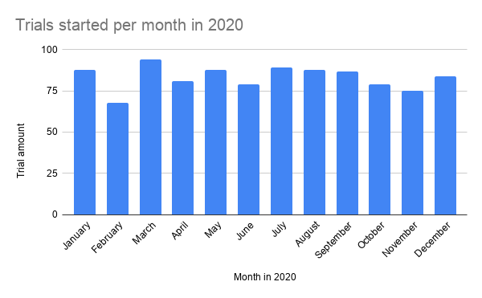
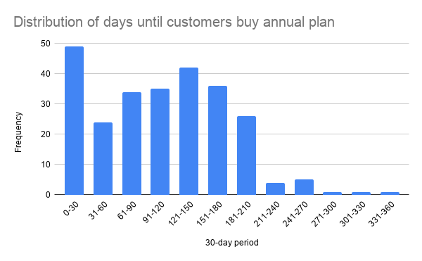

# **Foodie-Fi**


[https://8weeksqlchallenge.com/case-study-3/](https://8weeksqlchallenge.com/case-study-3/)

Queries written in (DB browser for) SQlite. 

# Case study questions and answers

### A. Customer Journey

*Based off the 8 sample customers provided in the sample from the `subscriptions` table, write a brief description about each customer’s onboarding journey.*
*Try to keep it as short as possible - you may also want to run some sort of join to make your explanations a bit easier!*

**Query:**

```sql
--Focus on the sample and describe each step of the customer journey
WITH sample_subscriptions AS (
    SELECT customer_id, start_date, concat(plan_name, ' (', start_date, ')' ) AS row_description
    FROM subscriptions
    JOIN plans USING (plan_id)
    WHERE customer_id IN (1,2,11,13,15,16,18,19)
)
--Combine the customer journey steps to get a complete description
SELECT customer_id AS "Customer id",
group_concat(row_description, ', ' ORDER BY start_date) AS Description --Order by start_date before concatenation to guarantee the right order
FROM sample_subscriptions
GROUP BY customer_id
```

**Result:**

| **Customer id** | **Description**                                                          |
| --------------- | ------------------------------------------------------------------------ |
| 1               | trial (2020-08-01), basic monthly (2020-08-08)                           |
| 2               | trial (2020-09-20), pro annual (2020-09-27)                              |
| 11              | trial (2020-11-19), churn (2020-11-26)                                   |
| 13              | trial (2020-12-15), basic monthly (2020-12-22), pro monthly (2021-03-29) |
| 15              | trial (2020-03-17), pro monthly (2020-03-24), churn (2020-04-29)         |
| 16              | trial (2020-05-31), basic monthly (2020-06-07), pro annual (2020-10-21)  |
| 18              | trial (2020-07-06), pro monthly (2020-07-13)                             |
| 19              | trial (2020-06-22), pro monthly (2020-06-29), pro annual (2020-08-29)    |

### B. Data Analysis Questions

1. *How many customers has Foodie-Fi ever had?*

**Query:**

```sql
SELECT COUNT(DISTINCT customer_id) AS "Customer amount"
FROM subscriptions
```

**Result:**

| **Customer amount** |
| ------------------- |
| 1000                |

2. *What is the monthly distribution of* *`trial`* *plan* *`start_date`* *values for our dataset - use the start of the month as the group by value*

**Query:**

```sql
SELECT date(start_date, 'start of month') AS Month, COUNT(*) AS "Trial amount"
FROM subscriptions
WHERE plan_id = 0
GROUP BY date(start_date, 'start of month')
```

**Result:**

| **Month**  | **Trial amount** |
| ---------- | ---------------- |
| 2020-01-01 | 88               |
| 2020-02-01 | 68               |
| 2020-03-01 | 94               |
| 2020-04-01 | 81               |
| 2020-05-01 | 88               |
| 2020-06-01 | 79               |
| 2020-07-01 | 89               |
| 2020-08-01 | 88               |
| 2020-09-01 | 87               |
| 2020-10-01 | 79               |
| 2020-11-01 | 75               |
| 2020-12-01 | 84               |

**Distribution graph:**



**Note:**

- Months were renamed manually in Google Sheets for readability.
- The reason we need to sort by the start of the month rather than just the month, is that there are also `start\_dates` in the dataset from the year 2021. 
  - If we look at every trial plan in April, for example, then that would cover both April 2020 and April 2021, when we only want it to count for a single month in time.
    - It turns out no trials were started outside of 2020, but there are changes to customer subscriptions in 2021 so it is still good to be aware of this.

3. *What plan* *`start_date`* *values occur after the year 2020 for our dataset? Show the breakdown by count of events for each* *`plan_name`*

**Query:**

```sql
SELECT plan_name AS "Plan name", COUNT(*) AS "Amount after 2020"
FROM subscriptions
JOIN plans USING (plan_id)
WHERE strftime('%Y', start_date) > '2020'
GROUP BY plan_name
```

**Result:**

| **Plan name** | **Amount after 2020** |
| ------------- | --------------------- |
| basic monthly | 8                     |
| churn         | 71                    |
| pro annual    | 63                    |
| pro monthly   | 60                    |

4. *What is the customer count and percentage of customers who have churned rounded to 1 decimal place?*

**Query:**

```sql
SELECT 
    COUNT(CASE WHEN plan_id = 4 THEN 1 END) AS "Churn count", 
    CAST(
        COUNT(CASE WHEN plan_id = 4 THEN 1 END) AS REAL --Cast as real to avoid integer rounding
    )/COUNT(DISTINCT customer_id) * 100 AS "Churn percentage"
FROM subscriptions
```

**Result:**

| **Churn count** | **Churn percentage** |
| --------------- | -------------------- |
| 307             | 30.7                 |

5. *How many customers have churned straight after their initial free trial - what percentage is this rounded to the nearest whole number?*

**Query:**

```sql
--Strings of plan_id sequences e.g. '0,4' for instant churns
WITH plan_sequence AS (
    SELECT customer_id, group_concat(plan_id, ',' ORDER BY start_date) AS plans
    FROM subscriptions
    GROUP BY customer_id
)
--Count instant churns and calculate the relative frequency of this number
SELECT 
    COUNT(CASE WHEN plans = '0,4' THEN 1 END) AS "Instant churn", 
    ROUND(
        CAST( 
            COUNT(CASE WHEN plans = '0,4' THEN 1 END) AS REAL
        ) / COUNT(*) * 100 --Use COUNT(*) since every row is already one customer
    ) AS Percentage
FROM plan_sequence
```

**Result:**

| **Instant churn** | **Percentage** |
| ----------------- | -------------- |
| 92                | 9.0            |

6. *What is the number and percentage of customer plans after their initial free trial?*

**Query:**

```sql
--Create an extra column for the plan_id of the next row
WITH next_plans AS (
    SELECT customer_id, plan_id, lead(plan_id) OVER(PARTITION BY customer_id ORDER BY start_date) AS next_plan
    FROM subscriptions
),
--Track total amount of customers
customer_count AS (
    SELECT COUNT(DISTINCT customer_id) AS total_customers
    FROM subscriptions
)
--Calculate occurrences and percentages of first plan after the free trial
SELECT plan_name AS "Plan after free trial", COUNT(*) AS Number, CAST(COUNT(*) AS REAL)/total_customers * 100 AS "Percentage"
FROM next_plans
CROSS JOIN customer_count
JOIN plans ON plans.plan_id = next_plan
WHERE next_plans.plan_id = 0
GROUP BY next_plan
```

**Result:**

| **Plan after free trial** | **Number** | **Percentage** |
| ------------------------- | ---------- | -------------- |
| basic monthly             | 546        | 54.6           |
| pro monthly               | 325        | 32.5           |
| pro annual                | 37         | 3.7            |
| churn                     | 92         | 9.2            |

**Learned:**

- Window function `lead()` to find the next row value of a column.

7. *What is the customer count and percentage breakdown of all 5* *`plan_name`* *values at* *`2020-12-31`?*

**Query:**

```sql
--Find the most recent plan per customer as of 2020-12-31
WITH current_plans AS (
    SELECT 
        customer_id, 
        plan_id, 
        plan_name, 
        row_number() OVER (
            PARTITION BY customer_id 
            ORDER BY start_date DESC
        ) AS current_plan
    FROM subscriptions
    JOIN plans USING (plan_id)
    WHERE start_date <= '2020-12-31'
),
--Track total amount of customers
customer_count AS (
    SELECT COUNT(DISTINCT customer_id) AS total_customers
    FROM subscriptions
)
--Calculate (relative) frequencies of each plan
SELECT 
    plan_name AS "Plan",
    COUNT(*) AS "Count", 
    CAST(
        COUNT(*) AS REAL
    )/total_customers * 100 AS "Percentage"
FROM current_plans
CROSS JOIN customer_count
WHERE current_plan = 1
GROUP BY plan_name
```

**Result:**

| **Plan**      | **Count** | **Percentage** |
| ------------- | --------- | -------------- |
| basic monthly | 224       | 22.4           |
| churn         | 236       | 23.6           |
| pro annual    | 195       | 19.5           |
| pro monthly   | 326       | 32.6           |
| trial         | 19        | 1.9            |

**Note:**

Since `start_date` cannot track more precisely than the day of the subscription, we won't be able to tell what the current plan of a customer is if they change their subscription on the same day. In those cases, `row_number` will arbitrarily choose one plan.

The following query counts the occurrences of more than 1 subscription change in a day: 

```sql
WITH customer_date_pairs AS (
    SELECT customer_id, start_date, COUNT(*) AS amount
    FROM subscriptions
    GROUP BY customer_id, start_date
)
SELECT *
FROM customer_date_pairs
WHERE amount > 1
```

It yields no rows, which tells us that in the current database this is not a problem at all.

8. *How many customers have upgraded to an annual plan in 2020?*

**Query:**

```sql
SELECT COUNT(DISTINCT customer_id) AS Amount
FROM subscriptions
WHERE plan_id = 3 AND strftime('%Y',start_date) = '2020'
```

**Result:**

| **Amount** |
| ---------- |
| 195        |

9. *How many days on average does it take for a customer to an annual plan from the day they join Foodie-Fi?*

**Query:**

```sql
WITH trial_dates AS (
    SELECT customer_id, start_date AS trial_date
    FROM subscriptions
    WHERE plan_id = 0
),
annual_dates AS (
    SELECT customer_id, start_date AS annual_date
    FROM subscriptions
    WHERE plan_id = 3
),
times_to_annual AS (
    SELECT customer_id, julianday(annual_date) - julianday(trial_date) AS time_to_annual 
    FROM trial_dates
    JOIN annual_dates USING (customer_id)
)
SELECT ROUND(AVG(time_to_annual)) AS "Average day count until annual plan"
FROM times_to_annual
```

**Result:**

| **Average day count until annual plan** |
| --------------------------------------- |
| 105.0                                   |

**Note:**

In this query we have assumed that every customer only upgrades to an annual plan once, and does not downgrade and then upgrade again later. This is justified by the following checking query returning no rows (which actually checks this for all plans at once, not just the annual plans):

```sql
WITH customer_plan_pairs AS (
    SELECT customer_id, plan_id, COUNT(*) AS amount
    FROM subscriptions
    GROUP BY customer_id, plan_id
)
SELECT *
FROM customer_plan_pairs
WHERE amount > 1
```

If there were any duplicates, we would have to rewrite our query to find the **minimal annual subscription date** by aggregating over the duplicates.

10. *Can you further breakdown this average value into 30 day periods (i.e. 0-30 days, 31-60 days etc)*

**Answer:**

The idea  is to take `time_to_annual` and divide it by 30, then take the ceiling (rounded up) of that value. For example any number (except 0) between 0 and 30 divided by 30 will round up to 1, and any number between 31 and 60 divided by 30 will round up to 2 etc. Once we have all the `time_to_annual` values grouped like this, we can directly count them.

**Query:**

```sql
WITH trial_dates AS (
	SELECT customer_id, start_date AS trial_date
	FROM subscriptions
	WHERE plan_id = 0
),
annual_dates AS (
	SELECT customer_id, start_date AS annual_date
	FROM subscriptions
	WHERE plan_id = 3
),
times_to_annual AS (
	SELECT customer_id, julianday(annual_date) - julianday(trial_date) AS time_to_annual 
	FROM trial_dates
	JOIN annual_dates USING (customer_id)
),
--Divide the times_to_annual into 30-day buckets (bucket 1, bucket 2 etc.) and count/average over each bucket
day_breakdown AS (
	SELECT 
		CAST(
			CEILING(time_to_annual / 30) --Division by 30 calculates what 30-day period time_to_annual is in
			AS INTEGER
		) AS bucket,
		COUNT(*) AS amount,
		ROUND(
			AVG(time_to_annual),
			2
		) AS avg_time
	FROM times_to_annual
	GROUP BY bucket
)
--Rename the buckets to 0-30, 31-60 etc.
SELECT 
	concat(
		CASE 
			WHEN bucket = 1 THEN '0' --The first period is an exception starting with 0 rather than 1
			ELSE (bucket - 1) * 30 + 1
		END, '-', bucket * 30
	) AS "30-day period",
	amount,
	avg_time
FROM day_breakdown
```

**Result:**

| 30-day period | amount | avg_time |
| ------------- | ------ | -------- |
| 0-30          | 49     | 9.96     |
| 31-60         | 24     | 42.33    |
| 61-90         | 34     | 71.44    |
| 91-120        | 35     | 100.69   |
| 121-150       | 42     | 133.36   |
| 151-180       | 36     | 162.06   |
| 181-210       | 26     | 190.73   |
| 211-240       | 4      | 224.25   |
| 241-270       | 5      | 257.2    |
| 271-300       | 1      | 285.0    |
| 301-330       | 1      | 327.0    |
| 331-360       | 1      | 346.0    |

**Distribution graph:**



11. *How many customers downgraded from a pro monthly to a basic monthly plan in 2020?*

**Query:**

```sql
WITH prev_plans AS (
    SELECT *, lag(plan_id) OVER(PARTITION BY customer_id ORDER BY start_date) AS prev_plan
    FROM subscriptions
)
SELECT * 
FROM prev_plans
WHERE plan_id = 1 AND prev_plan = 2 AND strftime('%Y', start_date) = '2020'
```

**Result:**

No rows, so not a single customer downgraded from pro monthly to basic monthly in 2020.

**Learned:**

`lag()` window function, the opposite of `lead()`.

### C. Challenge Payment Question

*The Foodie-Fi team wants you to create a new* *`payments`* *table for the year 2020 that includes amounts paid by each customer in the* *`subscriptions`* *table with the following requirements:*

- *monthly payments always occur on the same day of month as the original* *`start_date`* *of any monthly paid plan*
- *upgrades from basic to monthly or pro plans are reduced by the current paid amount in that month and start immediately*
- *upgrades from pro monthly to pro annual are paid at the end of the current billing period and also starts at the end of the month period*
- *once a customer churns they will no longer make payments*

*Example outputs for this table might look like the following:*

| **customer\_id** | **plan\_id** | **plan\_name** | **payment\_date** | **amount** | **payment\_order** |
| ---------------- | ------------ | -------------- | ----------------- | ---------- | ------------------ |
| 1                | 1            | basic monthly  | 2020-08-08        | 9.90       | 1                  |
| 1                | 1            | basic monthly  | 2020-09-08        | 9.90       | 2                  |
| 1                | 1            | basic monthly  | 2020-10-08        | 9.90       | 3                  |
| 1                | 1            | basic monthly  | 2020-11-08        | 9.90       | 4                  |
| 1                | 1            | basic monthly  | 2020-12-08        | 9.90       | 5                  |
| 2                | 3            | pro annual     | 2020-09-27        | 199.00     | 1                  |
| 13               | 1            | basic monthly  | 2020-12-22        | 9.90       | 1                  |
| 15               | 2            | pro monthly    | 2020-03-24        | 19.90      | 1                  |
| 15               | 2            | pro monthly    | 2020-04-24        | 19.90      | 2                  |
| 16               | 1            | basic monthly  | 2020-06-07        | 9.90       | 1                  |
| 16               | 1            | basic monthly  | 2020-07-07        | 9.90       | 2                  |
| 16               | 1            | basic monthly  | 2020-08-07        | 9.90       | 3                  |
| 16               | 1            | basic monthly  | 2020-09-07        | 9.90       | 4                  |
| 16               | 1            | basic monthly  | 2020-10-07        | 9.90       | 5                  |
| 16               | 3            | pro annual     | 2020-10-21        | 189.10     | 6                  |
| 18               | 2            | pro monthly    | 2020-07-13        | 19.90      | 1                  |
| 18               | 2            | pro monthly    | 2020-08-13        | 19.90      | 2                  |
| 18               | 2            | pro monthly    | 2020-09-13        | 19.90      | 3                  |
| 18               | 2            | pro monthly    | 2020-10-13        | 19.90      | 4                  |
| 18               | 2            | pro monthly    | 2020-11-13        | 19.90      | 5                  |
| 18               | 2            | pro monthly    | 2020-12-13        | 19.90      | 6                  |
| 19               | 2            | pro monthly    | 2020-06-29        | 19.90      | 1                  |
| 19               | 2            | pro monthly    | 2020-07-29        | 19.90      | 2                  |
| 19               | 3            | pro annual     | 2020-08-29        | 199.00     | 3                  |

**Query:**

```sql
--Add rows for monthly payments
WITH RECURSIVE payment_months AS (
    --Base case
    SELECT 
        customer_id,
        plan_id,
        plan_name,
        start_date AS payment_date,
        printf('%.2f', price) AS amount
    FROM subscriptions
    JOIN plans USING (plan_id)
    WHERE plan_id != 0 AND start_date <= '2020-12-31' --Trials are irrelevant here
    
    --Recursive step 1: expand all the basic monthly payments until a pro monthly subscription is made
    UNION ALL
    
    SELECT 
        customer_id,
        plan_id,
        plans.plan_name,
        date(payment_date, '+0000-01-00') AS payment_date,
        printf('%.2f', price) AS amount
    FROM payment_months
    JOIN plans USING (plan_id)
    LEFT JOIN pro_monthly_dates USING (customer_id)
    LEFT JOIN pro_annual_dates USING (customer_id)
    LEFT JOIN churn_dates USING (customer_id)
    --End recursion when the next monthly payment (plan_id is either 1 or 2) will be in December 2020 or is at or before the pro_monthly/pro_annual/churn date
    WHERE 
        date(payment_date, '+0000-01-00') <= '2020-12-31' 
        AND 
            CASE 
                WHEN churn_date IS NOT NULL THEN date(payment_date, '+0000-01-00') <= churn_date --"<=" Because I'm assuming that monthly payments happen at midnight and before the customer can churn on that day
                ELSE 1 
            END 
        AND 
            CASE 
                WHEN pro_monthly_date IS NOT NULL THEN date(payment_date, '+0000-01-00') < pro_monthly_date
                ELSE 1 
            END 
        AND 
            CASE 
                WHEN pro_annual_date IS NOT NULL THEN date(payment_date, '+0000-01-00') < pro_annual_date 
                ELSE 1 
            END 
        AND plan_id IN (1,2)
    
    --Recursive step 2: expand all the pro monthly payments
    UNION ALL
    
    SELECT 
        customer_id,
        plan_id,
        plans.plan_name,
        date(payment_date, '+1 month') AS payment_date,
        printf('%.2f', price) AS amount
    FROM payment_months
    JOIN plans USING (plan_id)
    LEFT JOIN pro_monthly_dates USING (customer_id)
    LEFT JOIN pro_annual_dates USING (customer_id)
    LEFT JOIN churn_dates USING (customer_id)
    --End recursion when the next monthly payment (plan_id is 2) will be in December 2020 or is at or before the pro_annual/churn date
    WHERE 
        date(payment_date, '+0000-01-00') <= '2020-12-31' 
        AND 
            CASE 
                WHEN churn_date IS NOT NULL THEN date(payment_date, '+0000-01-00') <= churn_date --"<=" Because I'm assuming that monthly payments happen at midnight and before the customer can churn on that day
                ELSE 1 
            END 
        AND 
            CASE 
                WHEN pro_annual_date IS NOT NULL THEN date(payment_date, '+0000-01-00') < pro_annual_date 
                ELSE 1 
            END 
        AND plan_id = 2    
    ORDER BY customer_id 
),
pro_monthly_dates AS (
    SELECT customer_id, start_date AS pro_monthly_date
    FROM subscriptions
    WHERE plan_id = 2
),
pro_annual_dates AS (
    SELECT customer_id, start_date AS pro_annual_date
    FROM subscriptions
    WHERE plan_id = 3
),
churn_dates AS (
    SELECT customer_id, start_date AS churn_date
    FROM subscriptions
    WHERE plan_id = 4
),
--Add payment_order and track previous plans for upgrade comparisons
unupdated_payment_table AS(
    SELECT 
        customer_id,
        plan_id,
        plan_name,
        payment_date,
        amount,
        row_number() OVER(PARTITION BY customer_id ORDER BY payment_date) AS payment_order,
        lag(plan_id) OVER (PARTITION BY customer_id ORDER BY payment_date) AS prev_plan,
        lag(amount) OVER (PARTITION BY customer_id ORDER BY payment_date) AS prev_amount
    FROM payment_months
    WHERE plan_id IN (1,2,3)
)
--Add upgrade discounts
SELECT 
    customer_id,
    plan_id,
    plan_name,
    payment_date,
    CASE 
        WHEN prev_plan = 1 AND plan_id IN (2,3) THEN printf('%.2f', amount - prev_amount) --Upgrading from basic to pro monthly/annual
        ELSE printf('%.2f', amount)
    END AS amount,
    payment_order
FROM unupdated_payment_table
```

**Result (truncated to first 7 customers):**

| **customer\_id** | **plan\_id** | **plan\_name** | **payment\_date** | **amount** | **payment\_order** |
| ---------------- | ------------ | -------------- | ----------------- | ---------- | ------------------ |
| 1                | 1            | basic monthly  | 2020-08-08        | 9.90       | 1                  |
| 1                | 1            | basic monthly  | 2020-09-08        | 9.90       | 2                  |
| 1                | 1            | basic monthly  | 2020-10-08        | 9.90       | 3                  |
| 1                | 1            | basic monthly  | 2020-11-08        | 9.90       | 4                  |
| 1                | 1            | basic monthly  | 2020-12-08        | 9.90       | 5                  |
| 2                | 3            | pro annual     | 2020-09-27        | 199.00     | 1                  |
| 3                | 1            | basic monthly  | 2020-01-20        | 9.90       | 1                  |
| 3                | 1            | basic monthly  | 2020-02-20        | 9.90       | 2                  |
| 3                | 1            | basic monthly  | 2020-03-20        | 9.90       | 3                  |
| 3                | 1            | basic monthly  | 2020-04-20        | 9.90       | 4                  |
| 3                | 1            | basic monthly  | 2020-05-20        | 9.90       | 5                  |
| 3                | 1            | basic monthly  | 2020-06-20        | 9.90       | 6                  |
| 3                | 1            | basic monthly  | 2020-07-20        | 9.90       | 7                  |
| 3                | 1            | basic monthly  | 2020-08-20        | 9.90       | 8                  |
| 3                | 1            | basic monthly  | 2020-09-20        | 9.90       | 9                  |
| 3                | 1            | basic monthly  | 2020-10-20        | 9.90       | 10                 |
| 3                | 1            | basic monthly  | 2020-11-20        | 9.90       | 11                 |
| 3                | 1            | basic monthly  | 2020-12-20        | 9.90       | 12                 |
| 4                | 1            | basic monthly  | 2020-01-24        | 9.90       | 1                  |
| 4                | 1            | basic monthly  | 2020-02-24        | 9.90       | 2                  |
| 4                | 1            | basic monthly  | 2020-03-24        | 9.90       | 3                  |
| 5                | 1            | basic monthly  | 2020-08-10        | 9.90       | 1                  |
| 5                | 1            | basic monthly  | 2020-09-10        | 9.90       | 2                  |
| 5                | 1            | basic monthly  | 2020-10-10        | 9.90       | 3                  |
| 5                | 1            | basic monthly  | 2020-11-10        | 9.90       | 4                  |
| 5                | 1            | basic monthly  | 2020-12-10        | 9.90       | 5                  |
| 6                | 1            | basic monthly  | 2020-12-30        | 9.90       | 1                  |
| 7                | 1            | basic monthly  | 2020-02-12        | 9.90       | 1                  |
| 7                | 1            | basic monthly  | 2020-03-12        | 9.90       | 2                  |
| 7                | 1            | basic monthly  | 2020-04-12        | 9.90       | 3                  |
| 7                | 1            | basic monthly  | 2020-05-12        | 9.90       | 4                  |
| 7                | 2            | pro monthly    | 2020-05-22        | 10.00      | 5                  |
| 7                | 2            | pro monthly    | 2020-06-22        | 19.90      | 6                  |
| 7                | 2            | pro monthly    | 2020-07-22        | 19.90      | 7                  |
| 7                | 2            | pro monthly    | 2020-08-22        | 19.90      | 8                  |
| 7                | 2            | pro monthly    | 2020-09-22        | 19.90      | 9                  |
| 7                | 2            | pro monthly    | 2020-10-22        | 19.90      | 10                 |
| 7                | 2            | pro monthly    | 2020-11-22        | 19.90      | 11                 |
| 7                | 2            | pro monthly    | 2020-12-22        | 19.90      | 12                 |

**Note:**

The above query assumes that every pro monthly to pro annual upgrade happens on the correct date in the dataset. The following query checks all the instances for which this upgrade does not happen on the same day as the billing date:

```sql
WITH next_plans AS (
    SELECT customer_id, plan_id, start_date, lead(plan_id) OVER (PARTITION BY customer_id ORDER BY start_date) AS next_plan, lead(start_date) OVER (PARTITION BY customer_id ORDER BY start_date) AS next_date
    FROM subscriptions
    WHERE plan_id IN (1,2,3)
    ORDER BY customer_id, start_date
),
date_checks AS (
SELECT 
    customer_id, 
    plan_id, 
    start_date, 
    CASE 
        WHEN plan_id = 2 AND next_plan = 3 THEN 
                                                CASE 
                                                    WHEN strftime('%d', start_date) != strftime('%d', next_date) THEN 0
                                                END
            
    END AS date_check
FROM next_plans
)
SELECT *
FROM date_checks
WHERE date_check = 0
```

**Result:**

| **customer\_id** | **plan\_id** | **start\_date** | **date\_check** |
| ---------------- | ------------ | --------------- | --------------- |
| 380              | 2            | 2020-11-29      | 0               |
| 873              | 2            | 2020-03-31      | 0               |
| 960              | 2            | 2020-10-29      | 0               |

If we look at these 3 cases in the `subscriptions` table, then we find this:


| **customer\_id** | **plan\_id** | **start\_date** |
| ---------------- | ------------ | --------------- |
| 380              | 0            | 2020-08-01      |
| 380              | 1            | 2020-08-08      |
| 380              | 2            | 2020-11-29      |
| 380              | 3            | 2021-02-28      |
| 873              | 0            | 2020-03-24      |
| 873              | 2            | 2020-03-31      |
| 873              | 3            | 2020-06-30      |
| 960              | 0            | 2020-10-22      |
| 960              | 2            | 2020-10-29      |
| 960              | 3            | 2021-02-28      |

We can see that in all of these instances, the pro monthly to pro annual upgrade took place at the correct time, it’s just that the month that the pro annual upgrade took place in did not have the amount of days that the pro monthly billing date was based on. Hence, these upgrades/payments are still happening at the correct time, our assumption was correct and we do not have to write new logic for our payment table query.

### D. Outside The Box Questions

*The following are open ended questions which might be asked during a technical interview for this case study - there are no right or wrong answers, but answers that make sense from both a technical and a business perspective make an amazing impression!*

1. *How would you calculate the rate of growth for Foodie-Fi?*

**Answer:**

Using the payment table from question C, we can calculate Foodie-Fi’s total revenue over some time period (years, seasons, months etc.). We can compare this revenue to the revenue from a previous period and get a percentage growth factor as:

$\frac{\text{newrevenue} - \text{oldrevenue}}{\text{oldrevenue}} * 100%$

2. *What key metrics would you recommend Foodie-Fi management to track over time to assess performance of their overall business?*

**Answer:**

I recommend tracking the following:

- Rate at which new customers come in to try out a trial subscription.
- Upgrade rate, especially from basic to pro 
  - Pro monthly to pro annual is a discount for the customer but guarantees the money for a year up front, so these two are about equally valuable.
- Churn rate, the main revenue loss condition.

Less important but still interesting:

- Average time until basic upgrades to something else.
- Average time until churn.

3. *What are some key customer journeys or experiences that you would analyse further to improve customer retention?*

**Answer:**

How many videos they watch, what kind, how long they watch them for and when.

This tells you if the customer is losing interest in the material from your streaming service and if you need a larger quality/variety of content.

4. *If the Foodie-Fi team were to create an exit survey shown to customers who wish to cancel their subscription, what questions would you include in the survey?*

**Answer:**

- What was the primary reason you decided to cancel your subscription?
  - Multiple choice with the options being answers to the questions below
- How would you rate the visual styling of Foodie-Fi’s interface?
- How would you rate Foodie-Fi’s (website) navigability?
- How would you rate Foodie-Fi’s content quality?
- How would you rate Foodie-Fi’s content variety?
- How fair do you think the pricing for the different kinds of subscriptions are?
  - Basic monthly
  - Pro monthly
  - Pro annual
- Do you have any other comments you want to make?

5. *What business levers could the Foodie-Fi team use to reduce the customer churn rate? How would you validate the effectiveness of your ideas?*

**Answer:**

Consider the query:

```sql
--Create an extra column for the plan_id of the previous row
WITH prev_plans AS (
    SELECT customer_id, plan_id, lag(plan_id) OVER(PARTITION BY customer_id ORDER BY start_date) AS prev_plan
    FROM subscriptions
)
--Calculate occurrences of plan before churn
SELECT plan_name AS "Plan before churn", COUNT(*) AS Number
FROM prev_plans
JOIN plans ON plans.plan_id = prev_plan
WHERE prev_plans.plan_id = 4 AND strftime('%Y',start_date) = '2020' 
GROUP BY prev_plan
```

**Result:**

| **Plan before churn** | **Number** |
| --------------------- | ---------- |
| trial                 | 90         |
| basic monthly         | 63         |
| pro monthly           | 83         |

Combine this with the result from question B7 for plan occurrences at the end of 2020:

| **Plan**      | **Count** | **Percentage** |
| ------------- | --------- | -------------- |
| basic monthly | 224       | 22.4           |
| churn         | 236       | 23.6           |
| pro annual    | 195       | 19.5           |
| pro monthly   | 326       | 32.6           |
| trial         | 19        | 1.9            |

This shows that pro annual customers are the most loyal, and that a large number of customers churn after a trial (not even getting on board). 

Other than increasing the service quality overall, one way to improve the onboarding rate would be to make basic monthly a more appealing subscription. I would do this by giving more access to videos. 

This way, once the customers are at least on board, they are statistically more likely to stay and possibly upgrade later to a pro subscription.

Another idea could be to lengthen the trial period by a week. Since the trial period is on the pro monthly plan, this can make them more likely to stay on pro monthly since they are now used to it. Since they get more used to your service in general, even the improved basic monthly can be enticing enough to stay around. 
