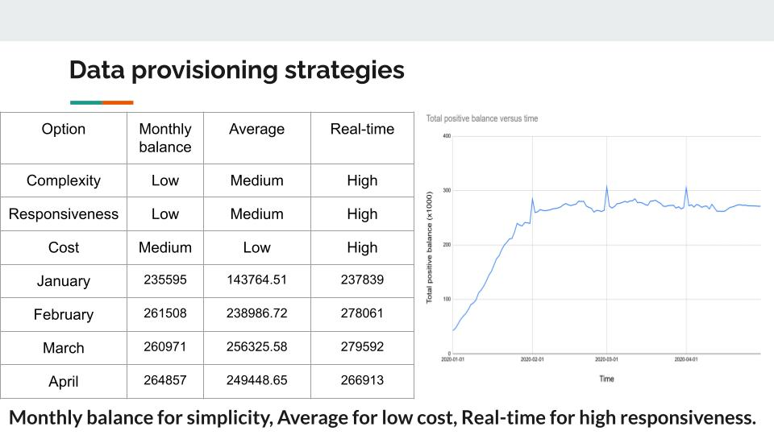

# **Data Bank**

[https://8weeksqlchallenge.com/case-study-4/](https://8weeksqlchallenge.com/case-study-4/)

Queries written in (DB browser for) SQlite. 

# **Case study questions and answers**

### **A. Customer Nodes Exploration**

1. *How many unique nodes are there on the Data Bank system?*

**Query:**

```sql
SELECT COUNT(DISTINCT node_id) AS "Unique node amount"
FROM customer_nodes
```

**Result:**

| Unique node amount |
| :---: |
| 5 |

2. *What is the number of nodes per region?*

**Query:**

```sql
SELECT region_name AS "Region name", COUNT(node_id) AS "Number of nodes"
FROM customer_nodes
JOIN regions USING (region_id)
GROUP BY region_name
```

**Result:**

| Region name | Number of nodes |
| :---: | :---: |
| Africa | 770 |
| America | 735 |
| Asia | 714 |
| Europe | 665 |
| Oceania | 616 |

3. *How many customers are allocated to each region?*

**Query:**

```sql
SELECT region_name AS "Region name", COUNT(DISTINCT customer_id) AS "Number of customers"
FROM customer_nodes
JOIN regions USING (region_id)
GROUP BY region_name
```

**Result:**

| Region name | Number of customers |
| :---: | :---: |
| Africa | 110 |
| America | 105 |
| Asia | 102 |
| Europe | 95 |
| Oceania | 88 |

4. *How many days on average are customers reallocated to a different node?*

**Query:**

```sql
SELECT 
    ROUND(
        AVG(
            julianday(end_date) - julianday(start_date) --Reallocation time 
            )
        ) AS "Average reallocation time in days"
FROM customer_nodes
WHERE strftime('%Y', end_date) < '9999'
```

**Result:**

| Average reallocation time in days |
| :---: |
| 15.0 |

5. *What is the median, 80th and 95th percentile for this same reallocation days metric for each region?*

**Query:**

```sql
WITH reallocation_times AS (
    SELECT region_id, julianday(end_date) - julianday(start_date) AS r_time
    FROM customer_nodes
    WHERE strftime('%Y', end_date) < '9999'
),
numbered_rows AS (
    SELECT 
        region_name,
        r_time,
        row_number() OVER (PARTITION BY region_name ORDER BY r_time) AS row_id
    FROM reallocation_times
    JOIN regions USING (region_id)
),
positions AS (
    SELECT 
        region_name,
        0.5 * (COUNT(row_id) + 1) AS median_position, 
        0.8 * (COUNT(row_id) + 1) AS "80th_percentile_position",
        0.95 * (COUNT(row_id) + 1) AS "95th_percentile_position"
    FROM numbered_rows
    GROUP BY region_name
),
medians AS (
    SELECT 
        numbered_rows.region_name,
        CASE 
            WHEN mod(median_position, 1) = 0 THEN r_time --The median position was an integer
            ELSE SUM(r_time) / 2 --The median position is in between two integers
        END AS "Median"
    FROM numbered_rows
    CROSS JOIN positions USING (region_name)
    WHERE row_id IN (floor(median_position), ceiling(median_position))
    GROUP BY numbered_rows.region_name
),
"80th_percentiles" AS (
    SELECT 
        numbered_rows.region_name,
        --Linearly interpolate a*(1-t) + b*t where a and b are the closest integers to the position and t is from 0 to 1
        MAX(
            CASE
                WHEN row_id = floor("80th_percentile_position") --Aggregate over the r_times to control what is a and what is b in the above comment
                THEN r_time
            END
        ) --"a"
        * 
        (1 - mod("80th_percentile_position", 1)) -- "(1-t)"
        +
        MAX(
            CASE
                WHEN row_id = ceiling("80th_percentile_position")
                THEN r_time
            END
        ) --"b"
        * 
        mod("80th_percentile_position", 1) --"t"
        AS "80th percentile"
    FROM numbered_rows
    CROSS JOIN positions USING (region_name)
    WHERE row_id IN (floor("80th_percentile_position"), ceiling("80th_percentile_position"))
    GROUP BY numbered_rows.region_name
),
--Same logic as 80-th percentile
"95th_percentiles" AS (
    SELECT 
        numbered_rows.region_name,
        MAX(
            CASE
                WHEN row_id = floor("95th_percentile_position")
                THEN r_time
            END
        )
        * 
        (1 - mod("95th_percentile_position", 1))
        +
        MAX(
            CASE
                WHEN row_id = ceiling("95th_percentile_position")
                THEN r_time
            END
        )
        * 
        mod("95th_percentile_position", 1) AS "95th percentile"
    FROM numbered_rows
    CROSS JOIN positions USING (region_name)
    WHERE row_id IN (floor("95th_percentile_position"), ceiling("95th_percentile_position"))
    GROUP BY numbered_rows.region_name
)
--Join everything
SELECT *
FROM medians
JOIN "80th_percentiles" USING (region_name)
JOIN "95th_percentiles" USING (region_name)
```

**Result:**

| region\_name | Median | 80th percentile | 95th percentile |
| :---: | :---: | :---: | :---: |
| Africa | 15.0 | 23.0 | 28.0 |
| America | 15.0 | 23.0 | 28.0 |
| Asia | 15.0 | 24.0 | 28.0 |
| Europe | 15.0 | 23.0 | 28.0 |
| Oceania | 15.0 | 24.0 | 28.0 |

**Note/learned:**

I’ve chosen to manually calculate the statistical metrics rather than using built-in functions: partially as an exercise and partially because the version of SQLite I am working with does not have these built-in functions.

As a result, I’ve had to make an assumption regarding percentile positions since the question does not state which one should be used (as it was probably intended to just be solved with built-in functions which have an assumption built in). I’ve assumed the convention that, for p the percentage (50% for median etc.) and n the amount of observations, the p-th percentile’s position is calculated as:

$p\ \cdot \ (n+\ 1)$

Although it needs to be said: since the metric in question here is reallocation time (“r\_time”), which is always in an *integer* amount of days, the above assumption is not very important for the result of the calculations. 

Furthermore, I’ve chosen to **linearly interpolate** the values for the p-th percentile rather than rounding for the nearest value in the dataset. For example, if the 80th-percentile position is 12.35, then we linearly interpolate (a(1-t) \* bt)  between the value $a$ at position 12  and the value $b$ at position 13 by doing:

$a\ \cdot \ 0.65\ +\ b\ \cdot \ 0.35{\ }$ 

### **B. Customer Transactions**

1. *What is the unique count and total amount for each transaction type?*

**Query:**

```sql
SELECT
    txn_type AS "Transaction type",
    COUNT(*) AS "Count",
    SUM(txn_amount) AS "Total amount"
FROM customer_transactions
GROUP BY txn_type
```

**Result:**

| Transaction type | Count | Total amount |
| :---: | :---: | :---: |
| deposit | 2671 | 1359168 |
| purchase | 1617 | 806537 |
| withdrawal | 1580 | 793003 |

**Note:**

The question asks for a “unique” count, so I checked if there are any duplicate rows in the “customer\_transactions” table that could influence the count. According to this query, there are not, so we are done:

```sql
WITH no_duplicates AS (
    SELECT DISTINCT * 
    FROM customer_transactions
)
SELECT COUNT(*) 
FROM no_duplicates
```

2. *What is the average total historical deposit counts and amounts for all customers?*

**Query:**

```sql
WITH customer_historical_data AS (
    SELECT 
        customer_id,
        COUNT(*) AS deposit_count,
        SUM(txn_amount) AS deposit_amount
    FROM customer_transactions
    WHERE txn_type = 'deposit'
    GROUP BY customer_id
)
SELECT 
    ROUND(AVG(deposit_count), 1) AS "Average total deposit count",
    ROUND(AVG(deposit_amount), 2) AS "Average total deposit amount"
FROM customer_historical_data
```

**Result:**

| Average total deposit count | Average total deposit amount |
| :---: | :---: |
| 5.3 | 2718.34 |

3. *For each month \- how many Data Bank customers make more than 1 deposit and either 1 purchase or 1 withdrawal in a single month?*

**Query:**

```sql
--Count the amount of transactions per type, customer and month
WITH counts AS (
    SELECT 
        date(txn_date, 'start of month') AS Month,
        customer_id,
        txn_type,
        COUNT(*) AS Amount
    FROM customer_transactions
    GROUP BY Month, txn_type, customer_id
),
--Only consider customers that, in one month, have deposited more than once and have done exactly one purchase or exactly one withdrawal
CTE AS (
    SELECT *
    FROM counts AS c
    WHERE 
        EXISTS (
            SELECT customer_id
            FROM counts
            WHERE c.customer_id = counts.customer_id 
            AND c.Month = counts.Month 
            AND txn_type = 'deposit' 
            AND Amount > 1
        ) 
        AND
        EXISTS (
            SELECT customer_id
            FROM counts
            WHERE c.customer_id = counts.customer_id 
            AND c.Month = counts.Month 
            AND (txn_type = 'purchase' OR txn_type = 'withdrawal') 
            AND Amount = 1
        )
    ORDER BY customer_id
)
--Remove any cases where a customer has both purchases and withdrawals in a single month
--Count all the customers that are left per month 
SELECT 
    Month, 
    COUNT(DISTINCT customer_id) AS Amount
FROM CTE AS C
WHERE
    NOT(
        EXISTS (
            SELECT customer_id
            FROM CTE
            WHERE C.customer_id = CTE.customer_id 
            AND C.Month = CTE.Month 
            AND txn_type = 'purchase'
        )
        AND 
        EXISTS (
            SELECT customer_id
            FROM CTE
            WHERE C.customer_id = CTE.customer_id 
            AND C.Month = CTE.Month
            AND txn_type = 'withdrawal'
        ))
GROUP BY Month
```

**Result:**

| Month | Amount |
| :---: | :---: |
| 2020-01-01 | 53 |
| 2020-02-01 | 36 |
| 2020-03-01 | 38 |
| 2020-04-01 | 22 |

**Note:**

“... *make more than 1 deposit and either 1 purchase or 1 withdrawal”* 

has been interpreted as: **the customer has done more than 1 deposit and has exactly 1 purchase, or has done more than 1 deposit and has exactly 1 withdrawal (per month)**. This seems to be the most natural interpretation to me.

If you take it literally though, then *either 1 purchase or 1 withdrawal* is valid when e.g. a customer has done 4 purchases and 1 withdrawal in the same month. This is because “either/or” is valid when exactly one of the two values is true, and in this example only the 1 withdrawal is true and the 4 purchases would not be 1 purchase and therefore be false, so the whole statement would be true. 

4. *What is the closing balance for each customer at the end of the month?*

**Query:**

```sql
WITH RECURSIVE monthly_sums AS (
    SELECT 
    customer_id,
    CAST(strftime('%m', txn_date) AS INTEGER) AS Month,    
    SUM(
        CASE
            WHEN txn_type = 'deposit' THEN txn_amount
            ELSE -txn_amount
    END) AS m_sum
    FROM customer_transactions
    GROUP BY customer_id, Month
),
last_months AS (
    SELECT MAX(Month) AS last_month
    FROM monthly_sums
),
--Cumulatively add previous balances to get the balance for this month
Balances AS (
    SELECT 
    customer_id AS "Customer id", 
    Month,
    lead(Month) OVER (PARTITION BY customer_id ORDER BY Month) AS next_month, --Needed for recursion later
    SUM(m_sum) OVER (
    PARTITION BY customer_id
    ORDER BY Month
    ROWS BETWEEN UNBOUNDED PRECEDING AND CURRENT ROW
    ) AS Balance
    FROM monthly_sums
),
--Add rows for months were customers' do not interact with the bank
recursive_months AS (
    SELECT 
        "Customer id",
        Month,
        Balance,
        next_month
    FROM Balances
    CROSS JOIN last_months
    
    UNION ALL
    
    SELECT 
        "Customer id",
        Month + 1,
        Balance,
        next_month
    FROM recursive_months
    CROSS JOIN last_months
    WHERE 
        CASE 
            WHEN next_month IS NOT NULL THEN Month + 1 < next_month
            ELSE Month + 1 < last_month + 1
        END
)
SELECT 
    "Customer id",
    Month,
    Balance
FROM recursive_months
ORDER BY "Customer id", Month
```

**Result (first 20 rows only):**

| Customer id | Month | Balance |
| :---: | :---: | :---: |
| 1 | 1 | 312 |
| 1 | 2 | 312 |
| 1 | 3 | \-640 |
| 1 | 4 | \-640 |
| 2 | 1 | 549 |
| 2 | 2 | 549 |
| 2 | 3 | 610 |
| 2 | 4 | 610 |
| 3 | 1 | 144 |
| 3 | 2 | \-821 |
| 3 | 3 | \-1222 |
| 3 | 4 | \-729 |
| 4 | 1 | 848 |
| 4 | 2 | 848 |
| 4 | 3 | 655 |
| 4 | 4 | 655 |
| 5 | 1 | 954 |
| 5 | 2 | 954 |
| 5 | 3 | \-1923 |
| 5 | 4 | \-2413 |

**Learned:** 

Using **SUM** as a window function and controlling which rows to sum with **ROWS BETWEEN UNBOUNDED PRECEDING AND CURRENT ROW.**

**Note:**

I’ve added rows for the balance of customers even in months where they do not perform any deposits, purchases or withdrawals, up until the final\_month which is calculated by the query. In the current dataset the final month is April 2020 (or month 4). 

5. *What is the percentage of customers who increase their closing balance by more than 5%?*

**Query:**

```sql
WITH monthly_sums AS (
    SELECT 
    customer_id,
    date(txn_date, 'start of month') AS Month,    
    SUM(
        CASE
            WHEN txn_type = 'deposit' THEN txn_amount
            ELSE -txn_amount
    END) AS m_sum
    FROM customer_transactions
    GROUP BY customer_id, Month
),
closing_balance AS (
--Cumulatively add previous balances to get the balance for this month
SELECT 
        customer_id, 
        Month,
        SUM(m_sum) OVER (
        PARTITION BY customer_id
        ORDER BY Month
        ROWS BETWEEN UNBOUNDED PRECEDING AND CURRENT ROW
        ) AS Balance
        FROM monthly_sums
),
prev_balances AS (
    SELECT 
        *,
        lag(Balance) OVER (PARTITION BY customer_id ORDER BY Month) AS prev_balance
    FROM closing_balance
),
percentage_increases AS (
    SELECT 
        *,
        100.0 * (Balance - prev_balance)/abs(prev_balance) AS percentage_increase
    FROM prev_balances
),
total_customers AS (
    SELECT COUNT(DISTINCT customer_id) AS total_customers
    FROM customer_transactions
)
SELECT 100.0 * COUNT(DISTINCT customer_id)/total_customers AS "Customer percentage"
FROM percentage_increases
CROSS JOIN total_customers
WHERE percentage_increase > 5
```

**Result:**

| Customer percentage |
| :---: |
| 67.0 |

**Note:**

For the percentual increase formula, we need to divide by the absolute value of the previous/old value to make sure that negative balances becoming more negative correspond to a negative increase, not a positive one.

Also, if a customer had a balance of 0 at some point and increased it after, this formula yields a percentual increase of NULL, even though they technically increased their balance by “an infinite percentage”. 

### **C. Data Allocation Challenge**

*To test out a few different hypotheses \- the Data Bank team wants to run an experiment where different groups of customers would be allocated data using 3 different options:*

* *Option 1: data is allocated based off the amount of money at the end of the previous month*  
* *Option 2: data is allocated on the average amount of money kept in the account in the previous 30 days*  
* *Option 3: data is updated real-time*

*For this multi-part challenge question \- you have been requested to generate the following data elements to help the Data Bank team estimate how much data will need to be provisioned for each option:*

* *running customer balance column that includes the impact each transaction*  
* *customer balance at the end of each month*  
* *minimum, average and maximum values of the running balance for each customer*

*Using all of the data available \- how much data would have been required for each option on a monthly basis?*

**Answer:**

Customers with a non-positive balance either owe the bank or have no money in the Data Bank, and hence it makes sense that they are allocated no data at all. This should be the case whether this balance is checked at the end of the month, calculated as an average or after every transaction. So, in the upcoming calculations we only consider customer’s positive balances as only those should (in some yet undecided proportion) directly correlate to how much data the customers are allocated.

The customer balance at the end of each month has already been calculated in question B4 and made into a view called **“customer\_balance\_per\_month”**. So now we can take that framework to perform new calculations for the 3 different options.

Finally, while the transactions given by “txn\_date” happen someplace during that date, the dataset does not have enough granularity to tell us exactly when on the day it happens. Therefore, I will assume that they essentially all take place at the end of the day. This matters a bit in some edge cases where we are counting differences between dates (julianday differences). This assumption makes the math work in the sense that now all transactions are exactly days apart from each other.

#### **Option 1:**

**Query:**

```sql
SELECT Month, SUM(Balance) AS "Total Positive Balance"
FROM customer_balance_per_month
WHERE Balance > 0
GROUP BY Month
```

**Result:**

| Month | Total Balance |
| :---: | :---: |
| 1 | 235595 |
| 2 | 261508 |
| 3 | 260971 |
| 4 | 264857 |

#### **Option 2:**

First, we query a table that shows us the running balance of all customers:

**Query:**

```sql
SELECT 
customer_id, 
txn_date,
SUM(
    CASE
        WHEN txn_type = 'deposit' THEN txn_amount
        ELSE -txn_amount
    END) 
    OVER (
    PARTITION BY customer_id
    ORDER BY txn_date
    ROWS BETWEEN UNBOUNDED PRECEDING AND CURRENT ROW
    ) AS Balance
FROM customer_transactions
ORDER BY customer_id, txn_date
```

**Result (first 3 customers):**

| customer\_id | txn\_date | Balance |
| :---: | :---: | :---: |
| 1 | 2020-01-02 | 312 |
| 1 | 2020-03-05 | \-300 |
| 1 | 2020-03-17 | 24 |
| 1 | 2020-03-19 | \-640 |
| 2 | 2020-01-03 | 549 |
| 2 | 2020-03-24 | 610 |
| 3 | 2020-01-27 | 144 |
| 3 | 2020-02-22 | \-821 |
| 3 | 2020-03-05 | \-1034 |
| 3 | 2020-03-19 | \-1222 |
| 3 | 2020-04-12 | \-729 |

This result will be saved as a view called **“customer\_running\_balances”** to be reused here and for option 3 later.

From this, we can immediately calculate the minimum and maximum running balances of every customer per month.

**Query:**

```sql
SELECT 
    customer_id AS "Customer id",
    CAST(strftime('%m', txn_date) AS INTEGER) AS "Month",
    MIN(Balance) AS "Minimum balance",
    MAX(Balance) AS "Maximum balance"
FROM customer_running_balances
GROUP BY customer_id, "Month"
```

**Result (first 3 customers):**

| Customer id | Month | Minimum balance | Maximum balance |
| :---: | :---: | :---: | :---: |
| 1 | 1 | 312 | 312 |
| 1 | 3 | \-640 | 24 |
| 2 | 1 | 549 | 549 |
| 2 | 3 | 610 | 610 |
| 3 | 1 | 144 | 144 |
| 3 | 2 | \-821 | \-821 |
| 3 | 3 | \-1222 | \-1034 |
| 3 | 4 | \-729 | \-729 |

To calculate the average balance over the last 30 days (which I’m going to count in terms of months, since the goal is summarising on a monthly basis), we need to also know how many days each balance was held, so that we can do a weighted average. For example, if someone’s balance in month 1 was at 1000 for 29 days, but then went down to 0 on the final day, their average should not just be the average of 1000 and 0, but much closer to 1000 as their balance was at 1000 for essentially the entire month. 

To do this, we take the running balance table again and now add a column that tracks how many days that balance was held (**“balance\_durations”** CTE below). Then we can later average over this per month and get our result. We also need to add rows to track what the balance was at the start of each month after the customer joined Data Bank, which happens in the **“first\_days\_balances”** CTE.

**Query:**

```sql
WITH RECURSIVE prev_balances AS (
    SELECT 
        *,
        lag(Balance) OVER (PARTITION BY customer_id ORDER BY txn_date) AS prev_balance
    FROM customer_running_balances
),
first_monthly_transactions AS (
    SELECT 
        customer_id, 
        date(txn_date, 'Start of month') AS "Month",
        MIN(txn_date) AS first_monthly_transaction
    FROM customer_transactions
    GROUP BY customer_id, "Month"
),
first_days_balances AS (
    SELECT 
        customer_id,
        txn_date,
        Balance
    FROM prev_balances
    JOIN first_monthly_transactions USING (customer_id)
    
    --Add a row for the start of every month for which the balance is equal to 0 
    --if the customer had not joined yet and equal to the previous balance if they have one
    UNION
    
    SELECT
        customer_id,
        date(txn_date, 'start of month'),
        CASE
            WHEN prev_balance IS NOT NULL THEN prev_balance
            ELSE 0
        END
    FROM prev_balances
    JOIN first_monthly_transactions USING (customer_id)
    WHERE txn_date = first_monthly_transaction
),
next_txn_dates AS (
    SELECT
        *,
        lead(txn_date) OVER (PARTITION BY customer_id ORDER BY txn_date) AS next_txn_date
    FROM first_days_balances
),
balance_durations AS (
    SELECT 
        customer_id, 
        txn_date, 
        Balance,
        CASE
            WHEN 
                --Calculate amount of days until the next txn_date in the same month and year
                strftime('%m', txn_date) = strftime('%m', next_txn_date) 
                AND 
                strftime('%Y', txn_date) = strftime('%Y', next_txn_date) 
                THEN 
                julianday(next_txn_date) - julianday(txn_date)
            ELSE
                --Calculate amount of days until end of the month (start of next month minus one day)
                julianday( 
                    date(
                        date(txn_date, '+1 month'), 'start of month'
                        )
                ) - 1 - julianday(txn_date)
                        
        END AS balance_duration
    FROM next_txn_dates
    ORDER BY customer_id, txn_date
),
weighted_average_cte AS (
    SELECT 
        *,
        CAST(strftime('%m', txn_date) AS INTEGER) AS "Month",
        Balance * balance_duration AS product
    FROM balance_durations
),
average_balances AS (
    SELECT 
        customer_id AS "Customer id",
        "Month",
        ROUND(SUM(product)/SUM(balance_duration), 2) AS average_balance,
        lead("Month") OVER (PARTITION BY customer_id ORDER BY "Month") AS next_month --Needed for recursion later
    FROM weighted_average_cte
    GROUP BY customer_id, "Month"
),
last_months AS (
    SELECT MAX("Month") AS last_month
    FROM average_balances
),
--Add rows for months where customers do not interact with the bank
recursive_months AS (
    SELECT 
        "Customer id",
        "Month",
        average_balance,
        next_month
    FROM average_balances
    CROSS JOIN last_months
    
    UNION ALL
    
    SELECT 
        "Customer id",
        "Month" + 1,
        average_balance,
        next_month
    FROM average_balances
    CROSS JOIN last_months
    WHERE 
        CASE 
            WHEN next_month IS NOT NULL THEN Month + 1 < next_month
            ELSE Month + 1 < last_month + 1
        END
)
SELECT 
    "Customer id",
    "Month",
    average_balance AS "Average balance"
FROM recursive_months
ORDER BY "Customer id", "Month"
```

**Result (first 20 rows):**

| Customer id | Month | Average balance |
| :---: | :---: | :---: |
| 1 | 1 | 301.6 |
| 1 | 2 | 301.6 |
| 1 | 3 | \-332.8 |
| 1 | 4 | \-332.8 |
| 2 | 1 | 512.4 |
| 2 | 2 | 512.4 |
| 2 | 3 | 563.23 |
| 2 | 4 | 563.23 |
| 3 | 1 | 19.2 |
| 3 | 2 | \-97.25 |
| 3 | 3 | \-1080.8 |
| 3 | 4 | \-916.0 |
| 4 | 1 | 496.4 |
| 4 | 2 | 496.4 |
| 4 | 3 | 809.4 |
| 4 | 4 | 809.4 |
| 5 | 1 | 815.02 |
| 5 | 2 | 815.02 |
| 5 | 3 | \-858.9 |
| 5 | 4 | \-2396.1 |

Writing this result as the view **“customer\_avg\_monthly\_balances”**, we can now sum all the averages grouped by all customers and get an idea of the global (positive) average balance. Hence, we get to see per month how much total data should be allocated on average to all customers.

**Query:**

```sql
SELECT 
    "Month",
    SUM("Average balance") AS "Total average balance"
FROM customer_avg_monthly_balances
WHERE "Average balance" > 0
GROUP BY "Month"
```

**Result:**

| Month | Total average balance |
| :---: | :---: |
| 1 | 143764.51 |
| 2 | 238986.72 |
| 3 | 256325.58 |
| 4 | 249448.65 |

#### **Option 3:**

If data allocation is updated in real time, then our **“customer\_running\_balances”** table already gives us the data allocation per customer at the times of the transaction dates. 

If we want to see how this translates to a total data allocation to all customers on a monthly basis, then we need to consider the customer’s balance at the finest granular detail of this dataset: every day of every month. 

Then, we can add all the positive balances per day and for the total 4-month-timespan of the dataset give a balance/data allocation distribution.

**Query:**

```sql
WITH RECURSIVE prev_balances AS (
    SELECT 
        *,
        lag(Balance) OVER (PARTITION BY customer_id ORDER BY txn_date) AS prev_balance,
        lead(txn_date) OVER (PARTITION BY customer_id ORDER BY txn_date) AS next_txn_date
    FROM customer_running_balances
),
first_transactions AS (
    SELECT 
        customer_id, 
        MIN(txn_date) AS first_transaction
    FROM customer_transactions
    GROUP BY customer_id
),
last_month AS (
    SELECT 
        MAX(strftime('%m', txn_date)) AS last_month
    FROM customer_transactions
),
first_days_balances AS (
    SELECT 
        customer_id,
        txn_date,
        Balance,
        next_txn_date
    FROM prev_balances
    JOIN first_transactions USING (customer_id)
    
    --Add a row for the start of the first month that the customer joins for which the balance shall be equal to 0 

    UNION
    
    SELECT
        customer_id,
        date(txn_date, 'start of month'),
        0,
        --The next_txn_date for the first day for the customer will be the current txn_date
        txn_date
    FROM prev_balances
    JOIN first_transactions USING (customer_id)
    WHERE 
        txn_date = first_transaction 
        AND
        date(txn_date, 'start of month') \!= first_transaction
),
--Add rows for days where customers do not interact with the bank
recursive_days AS (
    SELECT 
        customer_id,
        txn_date,
        Balance,
        next_txn_date
    FROM first_days_balances
    CROSS JOIN last_month
    
    UNION ALL
    
    SELECT 
        customer_id,
        date(txn_date, '+1 day'),
        Balance,
        next_txn_date
    FROM recursive_days
    CROSS JOIN last_month
    WHERE 
        CASE 
            WHEN next_txn_date IS NOT NULL THEN date(txn_date, '+1 day') < next_txn_date
            ELSE strftime('%m', date(txn_date, '+1 day')) <= last_month
        END
)
SELECT 
    customer_id AS "Customer id",
    txn_date AS "Date",
    Balance
FROM recursive_days
ORDER BY customer_id, txn_date
```

**Result (first 20 rows):**

| Customer id | Date | Balance |
| :---: | :---: | :---: |
| 1 | 2020-01-01 | 0 |
| 1 | 2020-01-02 | 312 |
| 1 | 2020-01-03 | 312 |
| 1 | 2020-01-04 | 312 |
| 1 | 2020-01-05 | 312 |
| 1 | 2020-01-06 | 312 |
| 1 | 2020-01-07 | 312 |
| 1 | 2020-01-08 | 312 |
| 1 | 2020-01-09 | 312 |
| 1 | 2020-01-10 | 312 |
| 1 | 2020-01-11 | 312 |
| 1 | 2020-01-12 | 312 |
| 1 | 2020-01-13 | 312 |
| 1 | 2020-01-14 | 312 |
| 1 | 2020-01-15 | 312 |
| 1 | 2020-01-16 | 312 |
| 1 | 2020-01-17 | 312 |
| 1 | 2020-01-18 | 312 |
| 1 | 2020-01-19 | 312 |
| 1 | 2020-01-20 | 312 |

Writing this result as the view **“customer\_daily\_balances”**, we add all positive balances of all customers for every day and graph the resulting data allocation distribution for every month.

**Note:**

I should more consciously choose to rename column names like “customer\_id” to “Customer id”. The extra bit of better presentation does not matter much for a simple query result, and in future views if I want to call this column again, I now have to type the new column name which is slightly more tedious.

**Query:**

```sql
SELECT
    "Date",
    SUM(Balance) AS "Total balance"
FROM customer_daily_balances
WHERE Balance >= 0
GROUP BY "Date"
```

**Result (first month):**

| Date | Total balance |
| :---: | :---: |
| 2020-01-01 | 13947 |
| 2020-01-02 | 18554 |
| 2020-01-03 | 28349 |
| 2020-01-04 | 38708 |
| 2020-01-05 | 46833 |
| 2020-01-06 | 51495 |
| 2020-01-07 | 58891 |
| 2020-01-08 | 69877 |
| 2020-01-09 | 72447 |
| 2020-01-10 | 79632 |
| 2020-01-11 | 90751 |
| 2020-01-12 | 96976 |
| 2020-01-13 | 107137 |
| 2020-01-14 | 116407 |
| 2020-01-15 | 127894 |
| 2020-01-16 | 135659 |
| 2020-01-17 | 149181 |
| 2020-01-18 | 162496 |
| 2020-01-19 | 166497 |
| 2020-01-20 | 177014 |
| 2020-01-21 | 186607 |
| 2020-01-22 | 193349 |
| 2020-01-23 | 199763 |
| 2020-01-24 | 201391 |
| 2020-01-25 | 214892 |
| 2020-01-26 | 233813 |
| 2020-01-27 | 230065 |
| 2020-01-28 | 229149 |
| 2020-01-29 | 237839 |
| 2020-01-30 | 236660 |
| 2020-01-31 | 235595 |

**Graph:**

![][image1]

Taking the maximum per month, we can calculate the maximum data allocation capacity that Data Bank will have to provide per month.

**Query:**

```sql
WITH real_time_balances AS (
    SELECT
    "Date",
    SUM(Balance) AS "Total balance"
FROM customer_daily_balances
WHERE Balance >= 0
GROUP BY "Date"
)
SELECT 
    CAST(strftime('%m', "Date") AS INTEGER) AS "Month",
    MAX("Total balance") AS "Maximum balance"
FROM real_time_balances
GROUP BY "Month"
```

**Result:**

| Month | Maximum balance |
| :---: | :---: |
| 1 | 237839 |
| 2 | 278061 |
| 3 | 279592 |
| 4 | 266913 |

### **D. Extra Challenge**

*Data Bank wants to try another option which is a bit more difficult to implement \- they want to calculate data growth using an interest calculation, just like in a traditional savings account you might have with a bank.*

*If the annual interest rate is set at 6% and the Data Bank team wants to reward its customers by increasing their data allocation based off the interest calculated on a daily basis at the end of each day, how much data would be required for this option on a monthly basis?*

*Special notes:*

* *Data Bank wants an initial calculation which does not allow for compounding interest, however they may also be interested in a daily compounding interest calculation so you can try to perform this calculation if you have the stamina\!*

**Answer:**

With an annual interest rate of 6%, that means that every day a customer earns:

$\ \frac{6%}{365}\ \times \ current\ balance\ \approx \ 0.000164\ \times \ current\ balance{\ }$

Hence, we can just multiply every customer’s balance at the end of the day by 0.06/365 to get their earned interest value. 

Nothing in the case study’s text implies that there is an interest rate from Data Bank on negative balances that the customer needs to pay back, which I assume is for simplicity’s sake. Hence we once again remove any negative balances for this case, since customers will not earn any data allocation off of positive interest when their bank account is negative. 

At first I tried to solve this by selecting from the **“customer\_daily\_balances”** view, but this turned into a dead end as I lacked some way to carry over the interest calculation between transaction dates (since the days with transactions on them already exist as rows in the table, so I can’t add them via recursion). 

The idea now is to start with an initialization table where every customer only has the first day in the dataset (2020-01-01) and track how the balance should change on any given days. Then, we can just recursively add new rows and track the balance directly and add the interest calculation.

By not applying interest rates to the balances themselves, we avoid compounding interest.

**Query:**

```sql
WITH RECURSIVE txn_global_data AS (
    SELECT 
        MIN(txn_date) AS first_global_transaction,
        MAX(strftime('%m', txn_date)) AS last_global_month
    FROM customer_transactions
),
--Keep track of how balance changes on every day that a transaction happens
daily_balance_changes AS (
    SELECT 
        customer_id,
        txn_date,
        SUM(
            CASE
                WHEN txn_type = 'deposit' THEN txn_amount
                ELSE -txn_amount
            END
        ) AS balance_change
    FROM customer_transactions
    GROUP BY customer_id, txn_date
),
initial_setup AS (
    SELECT 
        DISTINCT customer_id,
        first_global_transaction AS "date",
        last_global_month,
        first_global_transaction
    FROM customer_running_balances
    CROSS JOIN txn_global_data
),
--Add rows for all days for all customers and track balance without accounting for compounding interest
recursive_days AS (
    SELECT 
        i.customer_id,
        "date",    
        --Day 1 transactions are always deposits
        --If there is a day 1 deposit, then we get two rows so we aggregate and take the deposit row (the maximum)
        MAX(
            CASE 
                WHEN txn_date = first_global_transaction THEN d.balance_change
                ELSE 0
            END
        ) AS balance,
        CASE 
            WHEN txn_date = first_global_transaction THEN d.balance_change * 0.06/365
            ELSE 0
        END AS interest,
        last_global_month,
        first_global_transaction,
        d.txn_date,
        d.balance_change
    FROM initial_setup AS i
    LEFT JOIN daily_balance_changes AS d
    ON i.customer_id = d.customer_id
    AND i."date" = d.txn_date
    GROUP BY i.customer_id, "date"
    
    UNION ALL
    
    SELECT 
        r.customer_id,
        date("date", '+1 day'),
        --Add balance change if it exists that day
        CASE 
            WHEN d.balance_change IS NOT NULL 
            THEN r.balance + d.balance_change
            ELSE r.balance
        END,
        --Raw interest calculation
        CASE 
            WHEN d.balance_change IS NOT NULL 
            THEN
                --Only calculate interest for strictly positive balances
                CASE 
                    WHEN r.balance + d.balance_change > 0 THEN (r.balance + d.balance_change) *  0.06/365
                    ELSE 0
                END
            ELSE 
                --Only calculate interest for strictly positive balances
                CASE 
                    WHEN r.balance > 0 THEN r.balance * 0.06/365
                    ELSE 0
                END 
        END,
        last_global_month,
        first_global_transaction,
        d.txn_date,
        d.balance_change
    FROM recursive_days AS r
    LEFT JOIN daily_balance_changes AS d
    ON r.customer_id = d.customer_id
    AND date(r."date", '+1 day') = d.txn_date
    WHERE strftime('%m', date("date", '+1 day')) <= last_global_month
)
SELECT 
    CAST(strftime('%m', "Date") AS INTEGER) AS "Month", 
    ROUND(SUM(Interest), 2) AS "Total interest"
FROM recursive_days
GROUP BY "Month"
```

**Result:**

| Month | Total interest |
| :---: | :---: |
| 1 | 681.45 |
| 2 | 1247.41 |
| 3 | 1365.74 |
| 4 | 1288.21 |

Now we consider compounding interest as well. Our setup is already well-versed to add compounding interest: we simply only need to apply interest to the balance calculations, the rest is completely the same as before.

**Query:**

```sql
WITH RECURSIVE txn_global_data AS (
    SELECT 
        MIN(txn_date) AS first_global_transaction,
        MAX(strftime('%m', txn_date)) AS last_global_month
    FROM customer_transactions
),
--Keep track of how balance changes on every day that a transaction happens
daily_balance_changes AS (
    SELECT 
        customer_id,
        txn_date,
        SUM(
            CASE
                WHEN txn_type = 'deposit' THEN txn_amount
                ELSE -txn_amount
            END
        ) AS balance_change
    FROM customer_transactions
    GROUP BY customer_id, txn_date
),
initial_setup AS (
    SELECT 
        DISTINCT customer_id,
        first_global_transaction AS "date",
        last_global_month,
        first_global_transaction
    FROM customer_running_balances
    CROSS JOIN txn_global_data
),
--Add rows for all days for all customers and track balance accounting for compounding interest
recursive_days AS (
    SELECT 
        i.customer_id,
        "date",    
        --Day 1 transactions are always deposits
        --If there is a day 1 deposit, then we get two rows so we aggregate and take the deposit row (the maximum)
        MAX(
            CASE 
                WHEN txn_date = first_global_transaction THEN d.balance_change * (1 + 0.06/365)
                ELSE 0
            END
        ) AS balance,
        CASE 
            WHEN txn_date = first_global_transaction THEN d.balance_change * 0.06/365
            ELSE 0
        END AS interest,
        last_global_month,
        first_global_transaction,
        d.txn_date,
        d.balance_change
    FROM initial_setup AS i
    LEFT JOIN daily_balance_changes AS d
    ON i.customer_id = d.customer_id
    AND i."date" = d.txn_date
    GROUP BY i.customer_id, "date"
    
    UNION ALL
    
    SELECT 
        r.customer_id,
        date("date", '+1 day'),
        --Add balance change if it exists that day
        CASE 
            WHEN d.balance_change IS NOT NULL 
            THEN
                --Only calculate interest for strictly positive balances
                CASE 
                    WHEN r.balance + d.balance_change > 0 THEN (r.balance + d.balance_change) * (1 + 0.06/365)
                    ELSE r.balance + d.balance_change
                END
            ELSE 
                --Only calculate interest for strictly positive balances
                CASE 
                    WHEN r.balance > 0 THEN r.balance * (1 + 0.06/365)
                    ELSE r.balance
                END 
        END,
        --Raw interest calculation
        CASE 
            WHEN d.balance_change IS NOT NULL 
            THEN
                --Only calculate interest for strictly positive balances
                CASE 
                    WHEN r.balance + d.balance_change > 0 THEN (r.balance + d.balance_change) *  0.06/365
                    ELSE 0
                END
            ELSE 
                --Only calculate interest for strictly positive balances
                CASE 
                    WHEN r.balance > 0 THEN r.balance * 0.06/365
                    ELSE 0
                END 
        END,
        last_global_month,
        first_global_transaction,
        d.txn_date,
        d.balance_change
    FROM recursive_days AS r
    LEFT JOIN daily_balance_changes AS d
    ON r.customer_id = d.customer_id
    AND date(r."date", '+1 day') = d.txn_date
    WHERE strftime('%m', date("date", '+1 day')) <= last_global_month
)
SELECT 
    CAST(strftime('%m', "Date") AS INTEGER) AS "Month", 
    ROUND(SUM(Interest), 2) AS "Total interest"
FROM recursive_days
GROUP BY "Month"
```

**Result:**

| Month | Total interest |
| :---: | :---: |
| 1 | 682.44 |
| 2 | 1252.54 |
| 3 | 1376.42 |
| 4 | 1303.29 |

### **Extension Request**

*The Data Bank team wants you to use the outputs generated from the above sections to create a quick Powerpoint presentation which will be used as marketing materials for both external investors who might want to buy Data Bank shares and new prospective customers who might want to bank with Data Bank.*

1. *Using the outputs generated from the customer node questions, generate a few headline insights which Data Bank might use to market its world-leading security features to potential investors and customers.*

**“A global bank that never sits still”**

**“Dynamic security from all over the world”**

**“Consistently changing, efficiently secure”**

2. *With the transaction analysis \- prepare a 1 page presentation slide which contains all the relevant information about the various options for the data provisioning so the Data Bank management team can make an informed decision.*



