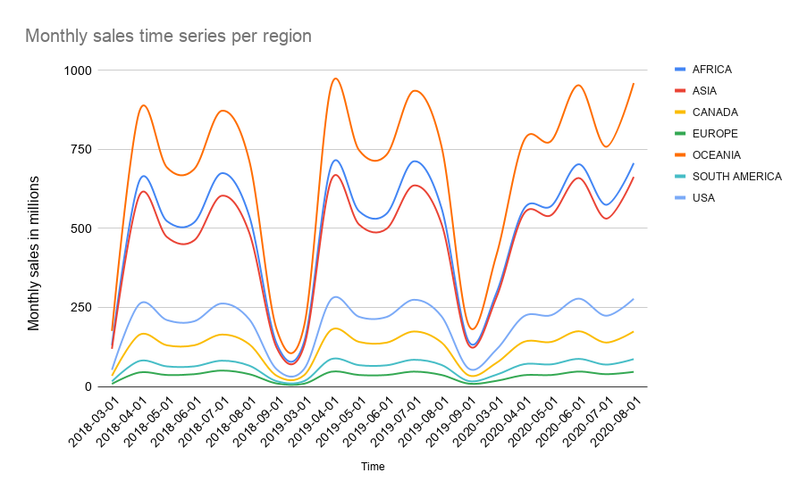

# **Data Mart**

[https://8weeksqlchallenge.com/case-study-5/](https://8weeksqlchallenge.com/case-study-5/)

Queries written in (DB browser for) SQlite. 

# Case study questions and answers

### 1. Data Cleansing Steps

*In a single query, perform the following operations and generate a new table in the* *`data_mart`* *schema named* *`clean_weekly_sales`:*

- *Convert the* *`week_date`* *to a* *`DATE`* *format*


- *Add a* *`week_number`* *as the second column for each* *`week_date`* *value, for example any value from the 1st of January to 7th of January will be 1, 8th to 14th will be 2 etc*


- *Add a* *`month_number`* *with the calendar month for each* *`week_date`* *value as the 3rd column*


- *Add a* *`calendar_year`* *column as the 4th column containing either 2018, 2019 or 2020 values*


- *Add a new column called* *`age_band`* *after the original* *`segment`* *column using the following mapping on the number inside the* *`segment`* *value*


| ***segment*** | ***age_band*** |
| ------------- | -------------- |
| *1*           | *Young Adults* |
| *2*           | *Middle Aged*  |
| *3 or 4*      | *Retirees*     |

- *Add a new* *`demographic`* *column using the following mapping for the first letter in the* *`segment`* *values:*

| ***segment*** | ***demographic*** |
| ------------- | ----------------- |
| *C*           | *Couples*         |
| *F*           | *Families*        |

- *Ensure all* *`null`* *string values with an* *`"unknown"`* *string value in the original* *`segment`* *column as well as the new* *`age_band`* *and* *`demographic`* *columns*


- *Generate a new* *`avg_transaction`* *column as the* *`sales`* *value divided by* *`transactions`* *rounded to 2 decimal places for each record*

**Query:**

```sql
CREATE TABLE IF NOT EXISTS clean_weekly_sales(
  "week_date" DATE,
  "week_number" INTEGER,
  "month_number" INTEGER,
  "calendar_year" INTEGER,
  "region" TEXT,
  "platform" TEXT,
  "segment" TEXT,
  "age_band" TEXT,
  "demographic" TEXT,
  "customer_type" TEXT,
  "transactions" INTEGER,
  "sales" INTEGER,
  "avg_transaction" REAL
);


WITH year_week_day AS (
    SELECT 
        concat(
            '20', --Add prefix 20
            substr(
                week_date,
                instr(
                    substr(
                        week_date, 
                        instr(week_date, '/') + 1
                    ), -- String after the first '/' 
                    '/'
                ) -- Location of '/' in the string after the first '/' 
                +
                instr(week_date, '/') + 1 -- Add position of first '/' to get the position of second '/' in the entire string
            )
        ) AS Year, -- String after the second '/' (the year)
        substr(
            week_date,
            instr(week_date, '/') + 1,
            instr(
                substr(
                    week_date, 
                    instr(week_date, '/') + 1
                ), -- String after the first '/' 
                '/'
            ) -- Location of '/' in the string after the first '/' 
            - 
            1
        ) AS Month, -- String after the first '/' until second '/' (the month)
        substr(
            week_date,
            0,
            instr(week_date, '/')
        ) AS Day, -- String before first '/' (the day)
        region, 
        platform, 
        segment, 
        customer_type, 
        transactions, 
        sales
    FROM weekly_sales
),
clean_week_dates AS (
    SELECT
        concat(
            Year,
            '-',
            --Check if we need to add a prefix 0 to single digit days/months
            CASE 
                WHEN length(Month) = 1 THEN concat('0', Month)
                ELSE Month
            END,
            '-',
            CASE 
                WHEN length(Day) = 1 THEN concat('0', Day)
                ELSE Day
            END
        ) AS week_date,
        region, 
        platform, 
        segment, 
        customer_type, 
        transactions, 
        sales
    FROM year_week_day    
)
INSERT INTO clean_weekly_sales (week_date, week_number, month_number, calendar_year, region, platform, segment, age_band, demographic, customer_type, transactions, sales, avg_transaction)
SELECT
    week_date,
    (CAST(strftime('%V', week_date) AS INTEGER),
    CAST(strftime('%m', week_date) AS INTEGER),
    CAST(strftime('%Y', week_date) AS INTEGER),
    region, 
    platform,
    CASE 
        WHEN segment = 'null' THEN 'unknown'
        ELSE segment
    END,
    --Check second string value for age_band
    CASE
        WHEN segment = 'null' THEN 'unknown'
        WHEN substr(segment, 2) = '1' THEN 'Young Adults'
        WHEN substr(segment, 2) = '2' THEN 'Middle Aged'
        WHEN substr(segment, 2) = '3' OR substr(segment, 2) = '4' THEN 'Retirees'
    END,
    --Check first string value for demographic
    CASE
        WHEN segment = 'null' THEN 'unknown'
        WHEN substr(segment, 1, 1) = 'C' THEN 'Couples'
        WHEN substr(segment, 1, 1) = 'F' THEN 'Families'
    END,
    customer_type, 
    transactions, 
    sales,
    ROUND(
        CAST(sales AS REAL)/CAST(transactions AS REAL),
        2
    )
FROM clean_week_dates
```

**Result (first 10 rows):**

| **week_date** | **week_number** | **month_number** | **calendar_year** | **region** | **platform** | **segment** | **age_band** | **demographic** | **customer_type** | **transactions** | **sales** | **avg_transaction** |
| ------------- | --------------- | ---------------- | ----------------- | ---------- | ------------ | ----------- | ------------ | --------------- | ----------------- | ---------------- | --------- | ------------------- |
| 2020-08-31    | 36              | 8                | 2020              | ASIA       | Retail       | C3          | Retirees     | Couples         | New               | 120631           | 3656163   | 30.31               |
| 2020-08-31    | 36              | 8                | 2020              | ASIA       | Retail       | F1          | Young Adults | Families        | New               | 31574            | 996575    | 31.56               |
| 2020-08-31    | 36              | 8                | 2020              | USA        | Retail       | unknown     | unknown      | unknown         | Guest             | 529151           | 16509610  | 31.2                |
| 2020-08-31    | 36              | 8                | 2020              | EUROPE     | Retail       | C1          | Young Adults | Couples         | New               | 4517             | 141942    | 31.42               |
| 2020-08-31    | 36              | 8                | 2020              | AFRICA     | Retail       | C2          | Middle Aged  | Couples         | New               | 58046            | 1758388   | 30.29               |
| 2020-08-31    | 36              | 8                | 2020              | CANADA     | Shopify      | F2          | Middle Aged  | Families        | Existing          | 1336             | 243878    | 182.54              |
| 2020-08-31    | 36              | 8                | 2020              | AFRICA     | Shopify      | F3          | Retirees     | Families        | Existing          | 2514             | 519502    | 206.64              |
| 2020-08-31    | 36              | 8                | 2020              | ASIA       | Shopify      | F1          | Young Adults | Families        | Existing          | 2158             | 371417    | 172.11              |
| 2020-08-31    | 36              | 8                | 2020              | AFRICA     | Shopify      | F2          | Middle Aged  | Families        | New               | 318              | 49557     | 155.84              |
| 2020-08-31    | 36              | 8                | 2020              | AFRICA     | Retail       | C3          | Retirees     | Couples         | New               | 111032           | 3888162   | 35.02               |

**Note:**

Since SQlite does not support automatically converting the date formats, I’ve taken this as an exercise in string manipulation. The logic for that is written in `day_week_year` and then concatenated in `clean_week_dates`. These CTEs also contain a lot of the other columns so I can pass those through later rather than having to write a join statement (and needing to create some kind of identifiers to link to).

### 2. Data Exploration

1. *What day of the week is used for each* *`week_date`* *value?*

**Query:**

```sql
WITH days_of_the_week (number, name) AS(
    VALUES 
        ('1', 'Monday'),
        ('2', 'Tuesday'),
        ('3', 'Wednesday'),
        ('4', 'Thursday'),
        ('5', 'Friday'),
        ('6', 'Saturday'),
        ('7', 'Sunday')    
)

SELECT DISTINCT name AS "Day of the week"
FROM clean_weekly_sales
JOIN days_of_the_week ON strftime('%u', week_date) = number
```

**Result:**

| **Day of the week** |
| ------------------- |
| Monday              |

2. *What range of week numbers are missing from the dataset?*

**Query:**

```sql
WITH present_week_numbers AS (
    SELECT DISTINCT week_number
    FROM clean_weekly_sales
),
min_and_max AS (
    SELECT 
        MIN(week_number) AS min_week_number,
        MAX(week_number) AS max_week_number
    FROM present_week_numbers
)
SELECT 
    concat(
        '1-', 
        CAST(min_week_number - 1 AS TEXT), 
        ', ', 
        CAST(max_week_number + 1 AS TEXT), 
        '-52'
    ) AS "Missing week numbers"
FROM min_and_max
```

**Result:**

| **Missing week numbers** |
| ------------------------ |
| 1-12, 37-52              |

**Note:**

After taking a look at the result from `present_week_numbers`, I could see that there were no gaps from weeks 12 to 36. Hence, I know that all the missing weeks are the weeks before and after that. 

If there were gaps, one could generate a CTE which has all week numbers, and then use a `NOT EXISTS` statement to find the missing week numbers.

After that we can concatenate all missing week numbers, and maybe group some together in a range (e.g. 2-6) if necessary. Since the numbers are simple in this exercise, I’ve chosen to go with the simpler query at the cost of some scalability.

3. *How many total transactions were there for each year in the dataset?*

**Query:**

```sql
SELECT calendar_year AS "Calendar year", SUM(transactions) AS "Total transactions"
FROM clean_weekly_sales
GROUP BY calendar_year
```

**Result:**

| **Calendar year** | **Total transactions** |
| ----------------- | ---------------------- |
| 2018              | 346406460              |
| 2019              | 365639285              |
| 2020              | 375813651              |

4. *What is the total sales for each region for each month?*

**Query:**

```sql
WITH total_sales AS (
    SELECT 
        region AS "Region",
        calendar_year AS "Year",
        month_number AS "Month number",
        SUM(sales) AS "Total sales"
    FROM clean_weekly_sales
    GROUP BY region, calendar_year, month_number
)
SELECT 
    region,
    concat(year, '-0', "Month number", '-01') AS "Month", 
    "Total sales"
FROM total_sales
```

**Result (first region):**

| **Region** | **Month**  | **Total sales** |
| ---------- | ---------- | --------------- |
| AFRICA     | 2018-03-01 | 130542213       |
| AFRICA     | 2018-04-01 | 650194751       |
| AFRICA     | 2018-05-01 | 522814997       |
| AFRICA     | 2018-06-01 | 519127094       |
| AFRICA     | 2018-07-01 | 674135866       |
| AFRICA     | 2018-08-01 | 539077371       |
| AFRICA     | 2018-09-01 | 135084533       |
| AFRICA     | 2019-03-01 | 141619349       |
| AFRICA     | 2019-04-01 | 700447301       |
| AFRICA     | 2019-05-01 | 553828220       |
| AFRICA     | 2019-06-01 | 546092640       |
| AFRICA     | 2019-07-01 | 711867600       |
| AFRICA     | 2019-08-01 | 564497281       |
| AFRICA     | 2019-09-01 | 141236454       |
| AFRICA     | 2020-03-01 | 295605918       |
| AFRICA     | 2020-04-01 | 561141452       |
| AFRICA     | 2020-05-01 | 570601521       |
| AFRICA     | 2020-06-01 | 702340026       |
| AFRICA     | 2020-07-01 | 574216244       |
| AFRICA     | 2020-08-01 | 706022238       |

**Graph:**



**Note:**

There is a noticeable dip in all sales in June 2020: exactly when the packaging change was introduced.
What is also interesting is that the usual April dip in sales was very minor in 2020 compared to the other years. There was even a peak in June 2020 when in the other years there’s a valley during June.

5. *What is the total count of transactions for each platform?*

**Query:**

```sql
SELECT platform AS "Platform", SUM(transactions) AS "Total transaction count"
FROM clean_weekly_sales
GROUP BY platform
```

**Result:**

| **Platform** | **Total transaction count** |
| ------------ | --------------------------- |
| Retail       | 1081934227                  |
| Shopify      | 5925169                     |

6. *What is the percentage of sales for Retail vs Shopify for each month?*

**Query:**

```sql
WITH platform_sales AS (
    SELECT 
        platform,
        calendar_year,
        month_number,
        SUM(sales) AS platform_sales
    FROM clean_weekly_sales
    WHERE platform = 'Retail'
    GROUP BY platform, calendar_year, month_number
),
monthly_total_sales AS (
    SELECT 
        calendar_year,
        month_number, 
        SUM(sales) AS total_sales
    FROM clean_weekly_sales
    GROUP BY 
        calendar_year,
        month_number
)
SELECT 
    calendar_year,
    month_number AS "Month",
    concat(
        ROUND(
            100 * CAST(platform_sales AS REAL)/CAST(total_sales AS REAL),
            1
        ),
        '/',
        ROUND( 
            100 - 100 * CAST(platform_sales AS REAL)/CAST(total_sales AS REAL),
            1
        )    
    ) AS "Retail/Shopify sales percentage"
FROM platform_sales
JOIN monthly_total_sales USING (calendar_year, month_number)
```

**Result:**

| **calendar_year** | **Month** | **Retail/Shopify sales percentage** |
| ----------------- | --------- | ----------------------------------- |
| 2018              | 3         | 97.9/2.1                            |
| 2018              | 4         | 97.9/2.1                            |
| 2018              | 5         | 97.7/2.3                            |
| 2018              | 6         | 97.8/2.2                            |
| 2018              | 7         | 97.8/2.2                            |
| 2018              | 8         | 97.7/2.3                            |
| 2018              | 9         | 97.7/2.3                            |
| 2019              | 3         | 97.7/2.3                            |
| 2019              | 4         | 97.8/2.2                            |
| 2019              | 5         | 97.5/2.5                            |
| 2019              | 6         | 97.4/2.6                            |
| 2019              | 7         | 97.4/2.6                            |
| 2019              | 8         | 97.2/2.8                            |
| 2019              | 9         | 97.1/2.9                            |
| 2020              | 3         | 97.3/2.7                            |
| 2020              | 4         | 97.0/3.0                            |
| 2020              | 5         | 96.7/3.3                            |
| 2020              | 6         | 96.8/3.2                            |
| 2020              | 7         | 96.7/3.3                            |
| 2020              | 8         | 96.5/3.5                            |

7. *What is the percentage of sales by demographic for each year in the dataset?*

**Query:**

```sql
WITH total_yearly_sales AS (
    SELECT calendar_year, SUM(sales) AS yearly_sales
    FROM clean_weekly_sales
    GROUP BY calendar_year
)
SELECT 
    calendar_year, 
    demographic,
    ROUND(
        100 * CAST(SUM(sales) AS REAL)/CAST(yearly_sales AS REAL),
        1
    ) AS "Sales percentage"
FROM clean_weekly_sales
JOIN total_yearly_sales USING (calendar_year)
GROUP BY calendar_year, demographic
```

**Result:**

| **calendar_year** | **demographic** | **Sales percentage** |
| ----------------- | --------------- | -------------------- |
| 2018              | Couples         | 26.4                 |
| 2018              | Families        | 32.0                 |
| 2018              | unknown         | 41.6                 |
| 2019              | Couples         | 27.3                 |
| 2019              | Families        | 32.5                 |
| 2019              | unknown         | 40.3                 |
| 2020              | Couples         | 28.7                 |
| 2020              | Families        | 32.7                 |
| 2020              | unknown         | 38.6                 |

8. *Which* *`age_band`* *and* *`demographic`* *values contribute the most to Retail sales?*

**Query:**

```sql
WITH best_age_band AS (
    SELECT 
        age_band,
        SUM(sales) AS ab_sales
    FROM clean_weekly_sales
    WHERE platform = 'Retail' AND age_band != 'unknown'
    GROUP BY age_band
    ORDER BY ab_sales DESC
    LIMIT 1
),
best_demographic AS (
    SELECT 
        demographic,
        SUM(sales) AS d_sales
    FROM clean_weekly_sales
    WHERE platform = 'Retail' AND demographic != 'unknown'
    GROUP BY demographic
    ORDER BY d_sales DESC
    LIMIT 1
)
SELECT 
    age_band AS "Most contributing age_band",
    demographic AS "Most contributing demographic"
FROM best_age_band
CROSS JOIN best_demographic
```

**Result:**

| **Most contributing age_band** | **Most contributing demographic** |
| ------------------------------ | --------------------------------- |
| Retirees                       | Families                          |

9. *Can we use the* *`avg_transaction`* *column to find the average transaction size for each year for Retail vs Shopify? If not - how would you calculate it instead?*

**Answer:**

The `avg_transaction` column calculates the averages over a week-long period. We cannot deduce the yearly averages from this metric without accounting for the amount of transactions that the weekly averages were individually taken over. You cannot just “average the averages” as you have lost crucial information during the first aggregation.

For example, if one week has only 10 transactions with a sales value of 100 and another week has 10000 transactions with a sales value of 10000, then the first week has an average transaction value of 10, and the second week has an average of 1. The average of these averages is 5.5. Week 2 however had *so many more transactions*, that if we take the average of the two weeks combined, we get

$10000 + \frac{100}{10000} + 10 \approx 1.009…$

The 10 transactions from week 1 are given too much weight if weeks 1 and 2 are weighted equally. 
So, we first get the total sum of transactions and sales per year for Retail vs Shopify, and then divide to average out at the end.

**Query:**

```sql
SELECT
    calendar_year,
    platform,
    ROUND(
        CAST(SUM(sales) AS REAL)/CAST(SUM(transactions) AS REAL),
        2
    ) AS yearly_average
FROM clean_weekly_sales
GROUP BY calendar_year, platform
```

**Result:**

| **calendar_year** | **platform** | **yearly_average** |
| ----------------- | ------------ | ------------------ |
| 2018              | Retail       | 36.56              |
| 2018              | Shopify      | 192.48             |
| 2019              | Retail       | 36.83              |
| 2019              | Shopify      | 183.36             |
| 2020              | Retail       | 36.56              |
| 2020              | Shopify      | 179.03             |

### 3. Before & After Analysis

*This technique is usually used when we inspect an important event and want to inspect the impact before and after a certain point in time.*
*Taking the* *`week_date`* *value of* *`2020-06-15`* *as the baseline week where the Data Mart sustainable packaging changes came into effect.*
*We would include all* *`week_date`* *values for* *`2020-06-15`* *as the start of the period* ***after*** *the change and the previous* *`week_date`* *values would be* ***before***
*Using this analysis approach - answer the following questions:*

1. *What is the total sales for the 4 weeks before and after* *`2020-06-15`? What is the growth or reduction rate in actual values and percentage of sales?*

**Query:**

```sql
WITH change_week_number AS (
    SELECT 
        DISTINCT week_number AS c_week_number
    FROM clean_weekly_sales
    WHERE week_date = '2020-06-15'
),
pre_sales AS (
    SELECT SUM(sales) AS pre_sales
    FROM clean_weekly_sales
    CROSS JOIN change_week_number
    WHERE
        strftime('%Y', week_date) = '2020'
        AND
        week_number BETWEEN c_week_number - 4 AND c_week_number - 1
)
SELECT 
    pre_sales,
    SUM(sales) AS post_sales,
    SUM(sales) - pre_sales AS "Absolute change",
    ROUND(
        100 * CAST(SUM(sales) - pre_sales AS REAL)/pre_sales,
        1
    ) AS "Relative change"
FROM clean_weekly_sales
CROSS JOIN pre_sales
CROSS JOIN change_week_number
WHERE 
    strftime('%Y', week_date) = '2020'
    AND
    week_number BETWEEN c_week_number AND c_week_number + 3
```

**Result:**

| **pre_sales** | **post_sales** | **Absolute change** | **Relative change** |
| ------------- | -------------- | ------------------- | ------------------- |
| 2345878357    | 2318994169     | -26884188           | -1.1                |

2. *What about the entire 12 weeks before and after?*

**Query (same as before but different intervals):**

```sql
WITH change_week_number AS (
    SELECT 
        DISTINCT week_number AS c_week_number
    FROM clean_weekly_sales
    WHERE week_date = '2020-06-15'
),
pre_sales AS (
    SELECT SUM(sales) AS pre_sales
    FROM clean_weekly_sales
    CROSS JOIN change_week_number
    WHERE
        strftime('%Y', week_date) = '2020'
        AND
        week_number BETWEEN c_week_number - 12 AND c_week_number - 1
)
SELECT 
    pre_sales,
    SUM(sales) AS post_sales,
    SUM(sales) - pre_sales AS "Absolute change",
    ROUND(
        100 * CAST(SUM(sales) - pre_sales AS REAL)/pre_sales,
        1
    ) AS "Relative change"
FROM clean_weekly_sales
CROSS JOIN pre_sales
CROSS JOIN change_week_number
WHERE 
    strftime('%Y', week_date) = '2020'
    AND
    week_number BETWEEN c_week_number AND c_week_number + 11
```

**Result:**

| **pre_sales** | **post_sales** | **Absolute change** | **Relative change** |
| ------------- | -------------- | ------------------- | ------------------- |
| 7126273147    | 6973947753     | -152325394          | -2.1                |

3. *How do the sale metrics for these 2 periods before and after compare with the previous years in 2018 and 2019?*

**Query:**

```sql
WITH change_week_number AS (
    SELECT 
        DISTINCT week_number AS c_week_number
    FROM clean_weekly_sales
    WHERE week_date = '2020-06-15'
),
pre_sales AS (
    SELECT 
        calendar_year,
        SUM(
            CASE 
                WHEN week_number BETWEEN c_week_number - 4 AND c_week_number - 1 
                THEN sales
            END
        ) AS pre_sales_4w,
        SUM(
            CASE 
                WHEN week_number BETWEEN c_week_number - 12 AND c_week_number - 1 
                THEN sales
            END
        ) AS pre_sales_12w
    FROM clean_weekly_sales
    CROSS JOIN change_week_number
    GROUP BY calendar_year
),
post_sales AS (
    SELECT 
        calendar_year,
        SUM(
            CASE 
                WHEN week_number BETWEEN c_week_number AND c_week_number + 3 
                THEN sales
            END
        ) AS post_sales_4w,
        SUM(
            CASE 
                WHEN week_number BETWEEN c_week_number AND c_week_number + 11 
                THEN sales
            END
        ) AS post_sales_12w
    FROM clean_weekly_sales
    CROSS JOIN change_week_number
    GROUP BY calendar_year
) 
SELECT 
    calendar_year,
    post_sales_4w - pre_sales_4w AS "Absolute change 4 week pre/post",
    post_sales_12w - pre_sales_12w AS "Absolute change 12 week pre/post",
    ROUND(
        100 * CAST(post_sales_4w - pre_sales_4w AS REAL)/pre_sales_4w,
        1
    ) AS "Relative change 4 week pre/post",
    ROUND(
        100 * CAST(post_sales_12w - pre_sales_12w AS REAL)/pre_sales_12w,
        1
    ) AS "Relative change 12 week pre/post"
FROM clean_weekly_sales
JOIN pre_sales USING (calendar_year)
JOIN post_sales USING (calendar_year)
CROSS JOIN change_week_number
GROUP BY calendar_year
```

**Result:**

| **calendar_year** | **Absolute change 4 week pre/post** | **Absolute change 12 week pre/post** | **Relative change 4 week pre/post** | **Relative change 12 week pre/post** |
| ----------------- | ----------------------------------- | ------------------------------------ | ----------------------------------- | ------------------------------------ |
| 2018              | 4102105                             | 104256193                            | 0.2                                 | 1.6                                  |
| 2019              | 2336594                             | -20740294                            | 0.1                                 | -0.3                                 |
| 2020              | -26884188                           | -152325394                           | -1.1                                | -2.1                                 |

### 4. Bonus Question

*Which areas of the business have the highest negative impact in sales metrics performance in 2020 for the 12 week before and after period?*

**Answer:**

We will perform the same 12 week before and after calculation, as before, but now grouping by any of the attributes of interest (region, platform etc.). We can read off the most negative value to see where Data Mart has suffered the most performance from the packaging change.
Every query here is essentially the same, but with a different attribute to group by. The most negative value is left to read off from the table rather than calculated directly in order to keep a full overview for later analysis.

- ### region

**Query:**

```sql
WITH change_week_number AS (
    SELECT 
        DISTINCT week_number AS c_week_number
    FROM clean_weekly_sales
    WHERE week_date = '2020-06-15'
),
pre_sales AS (
    SELECT 
        region,
        SUM(sales) AS pre_sales
    FROM clean_weekly_sales
    CROSS JOIN change_week_number
    WHERE
        strftime('%Y', week_date) = '2020'
        AND
        week_number BETWEEN c_week_number - 12 AND c_week_number - 1
    GROUP BY region
),
post_sales AS (
    SELECT 
        region,
        SUM(sales) AS post_sales
    FROM clean_weekly_sales
    CROSS JOIN change_week_number
    WHERE
        strftime('%Y', week_date) = '2020'
        AND
        week_number BETWEEN c_week_number AND c_week_number + 11
    GROUP BY region
)
SELECT 
    c.region,
    pre_sales,
    post_sales,
    post_sales - pre_sales AS "Absolute change",
    ROUND(
        100 * CAST(post_sales - pre_sales AS REAL)/pre_sales,
        1
    ) AS "Relative change"
FROM clean_weekly_sales AS c
JOIN pre_sales USING (region)
JOIN post_sales USING (region)
CROSS JOIN change_week_number
GROUP BY c.region
ORDER BY "Relative change" 
```

**Result:**

| **region**    | **Absolute change** | **Relative change** |
| ------------- | ------------------- | ------------------- |
| ASIA          | -53436845           | -3.3                |
| OCEANIA       | -71321100           | -3.0                |
| SOUTH AMERICA | -4584174            | -2.2                |
| CANADA        | -8174013            | -1.9                |
| USA           | -10814843           | -1.6                |
| AFRICA        | -9146811            | -0.5                |
| EUROPE        | 5152392             | 4.7                 |

**Answer:**

The most impacted groups here are Asia and Oceania.

- ### platform

**Query:**

```sql
WITH change_week_number AS (
    SELECT 
        DISTINCT week_number AS c_week_number
    FROM clean_weekly_sales
    WHERE week_date = '2020-06-15'
),
pre_sales AS (
    SELECT 
        platform,
        SUM(sales) AS pre_sales
    FROM clean_weekly_sales
    CROSS JOIN change_week_number
    WHERE
        strftime('%Y', week_date) = '2020'
        AND
        week_number BETWEEN c_week_number - 12 AND c_week_number - 1
    GROUP BY platform
),
post_sales AS (
    SELECT 
        platform,
        SUM(sales) AS post_sales
    FROM clean_weekly_sales
    CROSS JOIN change_week_number
    WHERE
        strftime('%Y', week_date) = '2020'
        AND
        week_number BETWEEN c_week_number AND c_week_number + 11
    GROUP BY platform
)
SELECT 
    c.platform,
    post_sales - pre_sales AS "Absolute change",
    ROUND(
        100 * CAST(post_sales - pre_sales AS REAL)/pre_sales,
        1
    ) AS "Relative change"
FROM clean_weekly_sales AS c
JOIN pre_sales USING (platform)
JOIN post_sales USING (platform)
CROSS JOIN change_week_number
GROUP BY c.platform
ORDER BY "Relative change"
```

**Result:**

| **platform** | **Absolute change** | **Relative change** |
| ------------ | ------------------- | ------------------- |
| Retail       | -168083834          | -2.4                |
| Shopify      | 15758440            | 7.2                 |

**Answer:**

The most impacted group here is Retail.

- ### age band

**Query:**

```sql
WITH change_week_number AS (
    SELECT 
        DISTINCT week_number AS c_week_number
    FROM clean_weekly_sales
    WHERE week_date = '2020-06-15'
),
pre_sales AS (
    SELECT 
        age_band,
        SUM(sales) AS pre_sales
    FROM clean_weekly_sales
    CROSS JOIN change_week_number
    WHERE
        strftime('%Y', week_date) = '2020'
        AND
        week_number BETWEEN c_week_number - 12 AND c_week_number - 1
    GROUP BY age_band
),
post_sales AS (
    SELECT 
        age_band,
        SUM(sales) AS post_sales
    FROM clean_weekly_sales
    CROSS JOIN change_week_number
    WHERE
        strftime('%Y', week_date) = '2020'
        AND
        week_number BETWEEN c_week_number AND c_week_number + 11
    GROUP BY age_band
)
SELECT 
    c.age_band,
    post_sales - pre_sales AS "Absolute change",
    ROUND(
        100 * CAST(post_sales - pre_sales AS REAL)/pre_sales,
        1
    ) AS "Relative change"
FROM clean_weekly_sales AS c
JOIN pre_sales USING (age_band)
JOIN post_sales USING (age_band)
CROSS JOIN change_week_number
GROUP BY c.age_band
ORDER BY "Relative change"
```

**Result:**

| **age_band** | **Absolute change** | **Relative change** |
| ------------ | ------------------- | ------------------- |
| unknown      | -92393021           | -3.3                |
| Middle Aged  | -22994292           | -2.0                |
| Retirees     | -29549521           | -1.2                |
| Young Adults | -7388560            | -0.9                |

**Answer:**

The most impacted group is the group of middle aged customers. The `unknown` age bands give us no tangible information, so we can discard it.

- ### demographic

**Query:**

```sql
WITH change_week_number AS (
    SELECT 
        DISTINCT week_number AS c_week_number
    FROM clean_weekly_sales
    WHERE week_date = '2020-06-15'
),
pre_sales AS (
    SELECT 
        demographic,
        SUM(sales) AS pre_sales
    FROM clean_weekly_sales
    CROSS JOIN change_week_number
    WHERE
        strftime('%Y', week_date) = '2020'
        AND
        week_number BETWEEN c_week_number - 12 AND c_week_number - 1
    GROUP BY demographic
),
post_sales AS (
    SELECT 
        demographic,
        SUM(sales) AS post_sales
    FROM clean_weekly_sales
    CROSS JOIN change_week_number
    WHERE
        strftime('%Y', week_date) = '2020'
        AND
        week_number BETWEEN c_week_number AND c_week_number + 11
    GROUP BY demographic
)
SELECT 
    c.demographic,
    post_sales - pre_sales AS "Absolute change",
    ROUND(
        100 * CAST(post_sales - pre_sales AS REAL)/pre_sales,
        1
    ) AS "Relative change"
FROM clean_weekly_sales AS c
JOIN pre_sales USING (demographic)
JOIN post_sales USING (demographic)
CROSS JOIN change_week_number
GROUP BY c.demographic
ORDER BY "Relative change"
```

**Result:**

| **demographic** | **Absolute change** | **Relative change** |
| --------------- | ------------------- | ------------------- |
| unknown         | -92393021           | -3.3                |
| Families        | -42320015           | -1.8                |
| Couples         | -17612358           | -0.9                |

**Answer:**

The most impacted group here is the group of families. The `unknown` demographic gives us no tangible information, so we can discard it.

- ### customer type

**Query:**

```sql
WITH change_week_number AS (
    SELECT 
        DISTINCT week_number AS c_week_number
    FROM clean_weekly_sales
    WHERE week_date = '2020-06-15'
),
pre_sales AS (
    SELECT 
        customer_type,
        SUM(sales) AS pre_sales
    FROM clean_weekly_sales
    CROSS JOIN change_week_number
    WHERE
        strftime('%Y', week_date) = '2020'
        AND
        week_number BETWEEN c_week_number - 12 AND c_week_number - 1
    GROUP BY customer_type
),
post_sales AS (
    SELECT 
        customer_type,
        SUM(sales) AS post_sales
    FROM clean_weekly_sales
    CROSS JOIN change_week_number
    WHERE
        strftime('%Y', week_date) = '2020'
        AND
        week_number BETWEEN c_week_number AND c_week_number + 11
    GROUP BY customer_type
)
SELECT 
    c.customer_type,
    post_sales - pre_sales AS "Absolute change",
    ROUND(
        100 * CAST(post_sales - pre_sales AS REAL)/pre_sales,
        1
    ) AS "Relative change"
FROM clean_weekly_sales AS c
JOIN pre_sales USING (customer_type)
JOIN post_sales USING (customer_type)
CROSS JOIN change_week_number
GROUP BY c.customer_type
ORDER BY "Relative change"
```

**Result:**

| **customer_type** | **Absolute change** | **Relative change** |
| ----------------- | ------------------- | ------------------- |
| Guest             | -77202666           | -3.0                |
| Existing          | -83872973           | -2.3                |
| New               | 8750245             | 1.0                 |

**Answer:**

The most impacted groups here are the group of Guests and the Existing customers. 

**Note:**

This time we do not discard the `Guest` customer types, because they do give tangible information: people who are not part of the Data Mart customer system have different sales than people who are. In contrast, `unknown` age bands and demographics don’t tell us anything useful at all.

One possible interpretation of the relative decrease in guest sales is that guests might be the least loyal, and therefore are quicker to go to other competitors when a new change like this happens.

*Do you have any further recommendations for Danny’s team at Data Mart or any interesting insights based off this analysis?*

**Answer:**

From the results above, the most impacted areas seem to be

- Retail
- Families
- Oceania and Asia
- Middle aged and retired customers 
- Guests and existing customers. 

It is noteworthy that some areas saw an increase in sales: Europe, Shopify and new customers had more sales after the packaging change than before. However, from the graph in question 2.4:


, question 2.6 and the smaller absolute changes in the tables above, we know that Europe and Shopify also contribute very little to the overall sales of Data Mart.

Furthermore, if we look closely at the graph from question 2.4, we can see in the graph that European sales *also* went down during the packaging change period. The European sales simply went up fast enough afterwards that it was not measurable in a 12 week time period.

On the other hand, from question 2.8 we know that families are the most contributing demographic while also being impacted the most. We also know that Retail sales are very much contributing the most (although shopify is slowly but steadily catching up as seen in question 2.6).

Keep in mind that all these results are descriptive, and do not guarantee that the packaging change caused the decline in sales. The results do, however, show us exactly where the decline in sales was the strongest and hence what areas warrant extra attention in the future.
