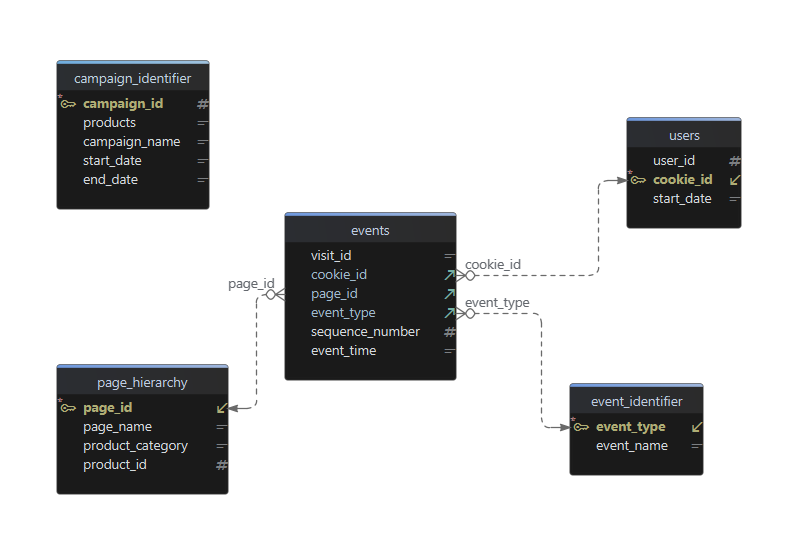
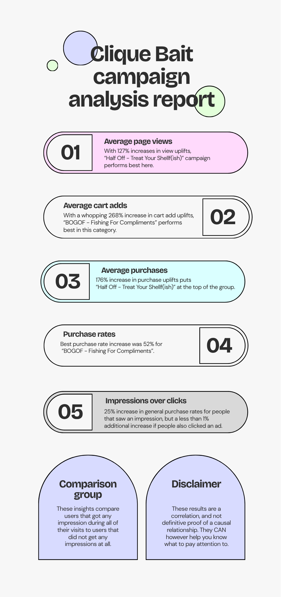

# **Clique Bait**

[https://8weeksqlchallenge.com/case-study-6/](https://8weeksqlchallenge.com/case-study-6/)

Queries written in (DB browser for) SQlite. 


# Case study questions and answers

### 1. Enterprise Relationship Diagram

*Use the following DDL schema details to create an ERD for all the Clique Bait datasets.*

```sql
CREATE TABLE clique_bait.event_identifier (
  "event_type" INTEGER,
  "event_name" VARCHAR(13)
);

CREATE TABLE clique_bait.campaign_identifier (
  "campaign_id" INTEGER,
  "products" VARCHAR(3),
  "campaign_name" VARCHAR(33),
  "start_date" TIMESTAMP,
  "end_date" TIMESTAMP
);

CREATE TABLE clique_bait.page_hierarchy (
  "page_id" INTEGER,
  "page_name" VARCHAR(14),
  "product_category" VARCHAR(9),
  "product_id" INTEGER
);

CREATE TABLE clique_bait.users (
  "user_id" INTEGER,
  "cookie_id" VARCHAR(6),
  "start_date" TIMESTAMP
);

CREATE TABLE clique_bait.events (
  "visit_id" VARCHAR(6),
  "cookie_id" VARCHAR(6),
  "page_id" INTEGER,
  "event_type" INTEGER,
  "sequence_number" INTEGER,
  "event_time" TIMESTAMP
);
```

**Answer:**

We first create primary/foreign key constraints on the tables as follows:

```sql
CREATE TABLE event_identifier (
  "event_type" INTEGER,
  "event_name" VARCHAR(13),
  PRIMARY KEY ("event_type")
);

CREATE TABLE campaign_identifier (
  "campaign_id" INTEGER,
  "products" VARCHAR(3),
  "campaign_name" VARCHAR(33),
  "start_date" TIMESTAMP,
  "end_date" TIMESTAMP,
  PRIMARY KEY ("campaign_id")
);

CREATE TABLE page_hierarchy (
  "page_id" INTEGER,
  "page_name" VARCHAR(14),
  "product_category" VARCHAR(9),
  "product_id" INTEGER,
  PRIMARY KEY ("page_id")
);

CREATE TABLE users (
  "user_id" INTEGER,
  "cookie_id" VARCHAR(6),
  "start_date" TIMESTAMP,
  PRIMARY KEY ("cookie_id")
);

CREATE TABLE events (
  "visit_id" VARCHAR(6),
  "cookie_id" VARCHAR(6),
  "page_id" INTEGER,
  "event_type" INTEGER,
  "sequence_number" INTEGER,
  "event_time" TIMESTAMP
  FOREIGN KEY ("event_type") REFERENCES event_identifier ("event_type")
  FOREIGN KEY ("cookie_id") REFERENCES users ("cookie_id")
  FOREIGN KEY ("page_id") REFERENCES page_hierarchy ("page_id")
);
```

Using DbSchema (version 10.4.0), our ERD looks like this:



**Note:**

I foresee two possible issues:

1. The `events` table has no primary key, there is currently no way to identify rows using a single column. The `event_time` column might be unique due to its time precision, but there is no guarantee that two people will not visit the website at the exact same time. I might add another auto-increment ID later on if necessary.


2. The `products` column from the `campaign_identifier` table has a range of products (e.g. 1-3) as values rather than individual products. This means that we cannot join that table to `page_hierarchy` on `product_id`. 

   If we split the range of products over multiple rows (which we will probably have to do at some point), then we can fix this problem. However, the `campaign_id` will then no longer be unique and hence not be suitable as a primary key for the `campaign_identifier` table anymore. We can solve that by making a junction table for pairs of (`campaign_id`, `products`) and having that exist alongside the original table.

### 2. Digital Analysis

*Using the available datasets - answer the following questions using a single query for each one:*

1. *How many users are there?*

**Query:**

```sql
SELECT COUNT(DISTINCT user_id) AS "User amount"
FROM users
```

**Result:**

| **User amount** |
| --------------- |
| 500             |

2. *How many cookies does each user have on average?*

**Query:**

```sql
WITH cookies_per_user AS (
    SELECT
        user_id,
        COUNT(*) AS cookie_amnt
    FROM users
    GROUP BY user_id
)
SELECT AVG(cookie_amnt) AS "Average amount of cookies"
FROM cookies_per_user
```

**Result:**

| **Average amount of cookies** |
| ----------------------------- |
| 3.564                         |

3. *What is the unique number of visits by all users per month?*

**Query:**

```sql
SELECT 
    strftime('%Y-%m', event_time) AS Month, 
    COUNT(DISTINCT visit_id) AS "Unique visits"
FROM events
GROUP BY Month
```

**Result:**

| **Month** | **Unique visits** |
| --------- | ----------------- |
| 2020-01   | 876               |
| 2020-02   | 1488              |
| 2020-03   | 916               |
| 2020-04   | 248               |
| 2020-05   | 36                |

4. *What is the number of events for each event type?*

**Query:**

```sql
SELECT event_name, COUNT(*) AS Amount
FROM events
JOIN event_identifier USING (event_type)
GROUP BY event_name
ORDER BY event_type
```

**Result:**

| **event_name** | **Amount** |
| -------------- | ---------- |
| Page View      | 20928      |
| Add to Cart    | 8451       |
| Purchase       | 1777       |
| Ad Impression  | 876        |
| Ad Click       | 702        |

5. *What is the percentage of visits which have a purchase event?*

**Query:**

```sql
WITH total_visits AS (
    SELECT COUNT(DISTINCT visit_id) AS total_visits
    FROM events
)
SELECT 
    ROUND(
        100 * CAST(
                COUNT(DISTINCT visit_id) AS REAL
        ) / total_visits,
        1    
    ) AS "Purchase percentage"
FROM events
CROSS JOIN total_visits 
WHERE event_type = 3
```

**Result:**

| **Purchase percentage** |
| ----------------------- |
| 49.9                    |

6. *What is the percentage of visits which view the checkout page but do not have a purchase event?*

**Query:**

```sql
WITH total_visits AS (
    SELECT COUNT(DISTINCT visit_id) AS total_visits
    FROM events
),
--Only consider visit_ids which view the checkout page
checkout_views AS (
    SELECT DISTINCT visit_id
    FROM events
    WHERE page_id = 12
)
SELECT 
    ROUND(
        CAST(
            100 * COUNT(*) AS REAL
        ) / total_visits,
        1
    ) AS percentage
FROM checkout_views AS c
CROSS JOIN total_visits
--Filter any rows for which the visit_id does not have a purchase event
WHERE NOT EXISTS (
    SELECT 1
    FROM events AS e
    WHERE c.visit_id = e.visit_id AND e.event_type = 3    
)
```

**Result:**

| **percentage** |
| -------------- |
| 9.1            |

**Note:**

This query took about 3 seconds to complete because the `WHERE NOT EXISTS` clause has to loop through the entire `events` table many times to look for specific `event_types`. I want to optimize this by adding a (composite) index to the `events` table for pairs of (`visit_id`, `event_type`):

**Query:**


```sql
CREATE INDEX idx_events_visit_type
ON events (visit_id, event_type)
```

**Result:**

The percentage calculation query can now be completed in \~20ms.

**Note/Learned:**

Basic indexing of tables to speed up performance when searching for specific values over and over. 

However, since this table is likely to be updated many times, the index would also constantly have to be updated. Hence, in a real-life setting at a certain scale this *could* become problematic if the goal is highly frequent analytics. 

One other approach that one could try is to first query a small table using a CTE that only tracks if a specific visit had checkout views and if it had purchase events. Then later on we can use this result directly to count the occurrences of visits with a checkout view but without a purchase event. This is more scalable but for the current challenge the index approach suffices so I will leave it at that.

7. *What are the top 3 pages by number of views?*

**Query:**

```sql
SELECT page_name, COUNT(*) AS Views
FROM events
JOIN page_hierarchy USING (page_id)
WHERE event_type = 1
GROUP BY page_name
ORDER BY Views DESC 
LIMIT 3
```

**Result:**

| **page_name** | **Views** |
| ------------- | --------- |
| All Products  | 3174      |
| Checkout      | 2103      |
| Home Page     | 1782      |

8. *What is the number of views and cart adds for each product category?*

**Query:**

```sql
SELECT 
    product_category,
    COUNT(
        CASE WHEN event_type = 1 THEN 1 END
    ) AS Views,
    COUNT(
        CASE WHEN event_type = 2 THEN 1 END
    ) AS "Cart adds"
FROM events
JOIN page_hierarchy USING (page_id)
WHERE product_category IS NOT NULL
GROUP BY product_category
```

**Result:**

| **product_category** | **Views** | **Cart adds** |
| -------------------- | --------- | ------------- |
| Fish                 | 4633      | 2789          |
| Luxury               | 3032      | 1870          |
| Shellfish            | 6204      | 3792          |

9. *What are the top 3 products by purchases?*

**Query:**

```sql
SELECT 
    page_name AS Product, 
    COUNT(
        CASE WHEN event_type = 2 THEN 1 END
    ) AS Amount
FROM events
JOIN page_hierarchy USING (page_id)
--Only consider visits with a purchase event
WHERE EXISTS (
    SELECT 1
    FROM events AS e
    WHERE events.visit_id = e.visit_id AND event_type = 3
)
GROUP BY page_name
ORDER BY Amount DESC
LIMIT 3
```

**Result:**

| **Product** | **Amount** |
| ----------- | ---------- |
| Lobster     | 754        |
| Oyster      | 726        |
| Crab        | 719        |

**Note:**

- We count cart adds per product, because the `purchase` event does not mention what was purchased. Hence, we need to track what products were added to the cart in the visits that have a purchase.
- The dataset is limited in that it does not track people removing items from carts, probably for simplicity. If that were a possibility, then we would have to instead first track every product’s timeline per visit (add to cart, removed from cart etc.), and then look if the last action for that product that visit was either an add or a remove before counting it as a product purchase.
- Our (`visit_id`, `event_type`) index from earlier speeds the query up once more.

### 3. Product Funnel Analysis

*Using a single SQL query - create a new output table which has the following details:*

- *How many times was each product viewed?*
- *How many times was each product added to cart?*
- *How many times was each product added to a cart but not purchased (abandoned)?*
- *How many times was each product purchased?*

**Query:**

```sql
WITH purchase_status AS (
    SELECT
        visit_id,
        MAX(event_type = 3) AS p_status
    FROM events
    GROUP BY visit_id
)
SELECT 
    page_name AS Product,
    SUM(event_type = 1) AS Viewed,
    SUM(event_type = 2) AS "Added to cart",
    SUM(event_type = 2 AND p_status = 0) AS Abandoned,
    SUM(event_type = 2 AND p_status = 1) AS Purchased
FROM events
JOIN page_hierarchy USING (page_id)
JOIN purchase_status USING (visit_id)
WHERE page_id BETWEEN 3 AND 11 --page_ids corresponding to products
GROUP BY page_name
ORDER BY page_id
```

**Result:**

| **Product**    | **Viewed** | **Added to cart** | **Abandoned** | **Purchased** |
| -------------- | ---------- | ----------------- | ------------- | ------------- |
| Salmon         | 1559       | 938               | 227           | 711           |
| Kingfish       | 1559       | 920               | 213           | 707           |
| Tuna           | 1515       | 931               | 234           | 697           |
| Russian Caviar | 1563       | 946               | 249           | 697           |
| Black Truffle  | 1469       | 924               | 217           | 707           |
| Abalone        | 1525       | 932               | 233           | 699           |
| Lobster        | 1547       | 968               | 214           | 754           |
| Crab           | 1564       | 949               | 230           | 719           |
| Oyster         | 1568       | 943               | 217           | 726           |

*Additionally, create another table which further aggregates the data for the above points but this time for each product category instead of individual products.*

**Query:**

```sql
WITH purchase_status AS (
    SELECT
        visit_id,
        MAX(event_type = 3) AS p_status
    FROM events
    GROUP BY visit_id
)
SELECT 
    product_category AS "Product category",
    SUM(event_type = 1) AS Viewed,
    SUM(event_type = 2) AS "Added to cart",
    SUM(event_type = 2 AND p_status = 0) AS Abandoned,
    SUM(event_type = 2 AND p_status = 1) AS Purchased
FROM events
JOIN page_hierarchy USING (page_id)
JOIN purchase_status USING (visit_id)
WHERE page_id BETWEEN 3 AND 11 --page_ids corresponding to products
GROUP BY product_category
ORDER BY page_id
```

**Result:**

| **Product category** | **Viewed** | **Added to cart** | **Abandoned** | **Purchased** |
| -------------------- | ---------- | ----------------- | ------------- | ------------- |
| Fish                 | 4633       | 2789              | 674           | 2115          |
| Luxury               | 3032       | 1870              | 466           | 1404          |
| Shellfish            | 6204       | 3792              | 894           | 2898          |

**Learned:**

Usage of `MAX` and `SUM` over booleans (which are numerically stored as 0 or 1 in SQLite), e.g. `SUM(event_type = 1)` adds 1 to the count if there was a view and 0 otherwise: it counts how many views there were.

**Note:**

We create 2 new views called `product_funnel` and `category_funnel` which view the results of the product and product category queries respectively.

*Using your 2 new output tables - answer the following questions:*

1. *Which product had the most views, cart adds and purchases?*

**Query:**

```sql
WITH most_viewed AS (
    SELECT 
        Product AS view_p,
        MAX(Viewed) AS m_view
    FROM product_funnel
),
most_cart_adds AS (
    SELECT 
        Product AS cart_p,
        MAX("Added to cart") AS m_cart
    FROM product_funnel

),
most_purchases AS (
    SELECT 
        Product AS purchase_p,
        MAX(Purchased) AS m_purchase
    FROM product_funnel
)
SELECT 
    view_p AS "Most views",
    cart_p AS "Most cart adds",
    purchase_p AS "Most purchases"
FROM most_viewed
CROSS JOIN most_cart_adds
CROSS JOIN most_purchases
```

**Result:**

| **Most views** | **Most cart adds** | **Most purchases** |
| -------------- | ------------------ | ------------------ |
| Oyster         | Lobster            | Lobster            |

2. *Which product was most likely to be abandoned?*

**Query:**

```sql
WITH most_abandoned AS (
    SELECT 
        Product,
        MAX(
            CAST("Abandoned" AS REAL)/"Added to cart"
        )    
    FROM product_funnel
)
SELECT Product 
FROM most_abandoned
```

**Result:**

| **Product**    |
| -------------- |
| Russian Caviar |

3. *Which product had the highest view to purchase percentage?*

**Query:**

```sql
WITH view_purchase AS (
    SELECT 
        Product,
        MAX(
            CAST(Purchased AS REAL) / Viewed
        )
    FROM product_funnel
)
SELECT Product 
FROM view_purchase
```

**Result:**

| **Product** |
| ----------- |
| Lobster     |

4. *What is the average conversion rate from view to cart add?*

**Query:**

```sql
SELECT 
    ROUND(
        AVG(
            CAST("Added to cart" AS REAL) / Viewed
        ),
        2
    ) AS "Average conversion rate"
FROM product_funnel
```

**Result:**

| **Average conversion rate** |
| --------------------------- |
| 0.61                        |

5. *What is the average conversion rate from cart add to purchase?*

**Query:**

```sql
SELECT 
    ROUND(
        AVG(
            CAST(Purchased AS REAL) / "Added to cart"
        ),
        2
    ) AS "Average conversion rate"
FROM product_funnel
```

**Result:**

| **Average conversion rate** |
| --------------------------- |
| 0.76                        |

### 4. Campaigns Analysis

*Generate a table that has 1 single row for every unique* *`visit_id`* *record and has the following columns:*

* `user_id`
* `visit_id`
* *`visit_start_time`: the earliest* *`event_time`* *for each visit*
* *`page_views`: count of page views for each visit*
* *`cart_adds`: count of product cart add events for each visit*
* *`purchase`: 1/0 flag if a purchase event exists for each visit*
* *`campaign_name`: map the visit to a campaign if the* *`visit_start_time`* *falls between the* *`start_date`* *and* *`end_date`*
* *`impression`: count of ad impressions for each visit*
* *`click`: count of ad clicks for each visit*
* ***(Optional column)*** *`cart_products`: a comma separated text value with products added to the cart sorted by the order they were added to the cart (hint: use the* *`sequence_number`)*

**Query:**

```sql
WITH visits AS (
    SELECT 
        user_id,
        visit_id,
        MIN(event_time) AS visit_start_time,
        SUM(event_type = 1) AS page_views,
        SUM(event_type = 2) AS cart_adds,
        MAX(event_type = 3) AS purchase,
        SUM(event_type = 4) AS impression,
        SUM(event_type = 5) AS click
    FROM events
    JOIN users USING (cookie_id)
    GROUP BY visit_id
),
cart_products AS (
    SELECT
        visit_id,
        group_concat(page_name, ', ') AS cart_products
    --Guarantee ordering by sequence number within each visit
    FROM (
        SELECT
            visit_id,
            page_name
        FROM events
        JOIN page_hierarchy USING (page_id)
        WHERE event_type = 2
        ORDER BY visit_id, sequence_number
    )
    GROUP BY visit_id
)
SELECT 
    user_id,
    visit_id,
    visit_start_time,
    page_views,
    cart_adds,
    purchase,
    campaign_name,
    impression,
    click,
    cart_products
FROM visits v
LEFT JOIN campaign_identifier c ON date(v.visit_start_time) BETWEEN c.start_date AND c.end_date 
LEFT JOIN cart_products USING (visit_id)
```

**Result (first 20 rows):**

| **user_id** | **visit_id** | **visit_start_time**       | **page_views** | **cart_adds** | **purchase** | **campaign_name** | **impression** | **click** | **cart_products**                                                            |
| ----------- | ------------ | -------------------------- | -------------- | ------------- | ------------ | ----------------- | -------------- | --------- | ---------------------------------------------------------------------------- |
| 237         | 005fe7       | 2020-04-02 18:14:08.257711 | 9              | 4             | 1            | <br>              | 0              | 0         | Kingfish, Black Truffle, Crab, Oyster                                        |
| 101         | 00b0a0       | 2020-05-17 06:29:28.529595 | 7              | 3             | 1            | <br>              | 0              | 0         | Tuna, Lobster, Crab                                                          |
| 208         | 01573b       | 2020-01-30 12:41:23.073956 | 6              | 2             | 1            | <br>              | 0              | 0         | Black Truffle, Lobster                                                       |
| 274         | 01b6e1       | 2020-04-03 04:48:41.310116 | 5              | 0             | 0            | <br>              | 0              | 0         | <br>                                                                         |
| 252         | 025883       | 2020-01-30 16:18:17.119806 | 7              | 3             | 1            | <br>              | 0              | 0         | Salmon, Abalone, Crab                                                        |
| 179         | 02a737       | 2020-04-12 14:53:11.851471 | 9              | 5             | 1            | <br>              | 1              | 1         | Kingfish, Tuna, Russian Caviar, Black Truffle, Abalone                       |
| 279         | 02abb3       | 2020-04-12 18:03:00.337732 | 1              | 0             | 0            | <br>              | 0              | 0         | <br>                                                                         |
| 322         | 02c3af       | 2020-04-10 16:33:12.783712 | 7              | 6             | 0            | <br>              | 1              | 1         | Kingfish, Tuna, Russian Caviar, Abalone, Crab, Oyster                        |
| 121         | 032d3b       | 2020-01-30 00:25:32.587602 | 8              | 5             | 1            | <br>              | 0              | 0         | Kingfish, Tuna, Russian Caviar, Abalone, Oyster                              |
| 393         | 03556e       | 2020-04-27 07:23:29.202187 | 7              | 2             | 0            | <br>              | 0              | 0         | Black Truffle, Lobster                                                       |
| 439         | 036b95       | 2020-04-11 23:19:32.68884  | 8              | 2             | 1            | <br>              | 0              | 0         | Abalone, Lobster                                                             |
| 284         | 038719       | 2020-04-23 05:42:37.855026 | 7              | 1             | 0            | <br>              | 0              | 0         | Salmon                                                                       |
| 471         | 03fa1b       | 2020-01-30 12:26:58.359477 | 5              | 2             | 1            | <br>              | 1              | 0         | Tuna, Russian Caviar                                                         |
| 110         | 04caa8       | 2020-04-07 02:57:02.833296 | 8              | 2             | 1            | <br>              | 0              | 0         | Kingfish, Russian Caviar                                                     |
| 390         | 050417       | 2020-04-18 20:08:49.873485 | 7              | 1             | 1            | <br>              | 0              | 0         | Salmon                                                                       |
| 234         | 053f59       | 2020-04-25 01:37:44.320632 | 6              | 4             | 0            | <br>              | 0              | 0         | Kingfish, Tuna, Russian Caviar, Crab                                         |
| 154         | 0559ba       | 2020-01-30 01:54:56.684249 | 8              | 3             | 0            | <br>              | 0              | 0         | Salmon, Abalone, Crab                                                        |
| 261         | 068c23       | 2020-04-29 00:55:25.474126 | 10             | 4             | 1            | <br>              | 1              | 1         | Kingfish, Tuna, Russian Caviar, Crab                                         |
| 466         | 06cc62       | 2020-04-09 10:53:02.713224 | 7              | 2             | 1            | <br>              | 1              | 1         | Lobster, Crab                                                                |
| 120         | 074e4e       | 2020-04-06 07:22:00.642709 | 10             | 8             | 1            | <br>              | 1              | 1         | Salmon, Kingfish, Tuna, Russian Caviar, Black Truffle, Lobster, Crab, Oyster |

**Note/learned:**

* We save our result as a view called `visits` for later use.
* I learned about **conditional joins** to join the `campaign_identifier` table depending on what the `visit_start_time` was for that visit.

*Use the subsequent dataset to generate at least 5 insights for the Clique Bait team - bonus: prepare a single A4 infographic that the team can use for their management reporting sessions, be sure to emphasise the most important points from your findings.*
*Some ideas you might want to investigate further include:*

- *Identifying users who have received impressions during each campaign period and comparing each metric with other users who did not have an impression event*

**Query:**

```sql
--Summary of metrics per user
WITH user_metrics AS (
    SELECT 
        user_id,
        campaign_name,
        SUM(page_views) AS total_views,
        SUM(cart_adds) AS total_adds,
        SUM(purchase) AS total_purchase,
        MAX(impression) AS impression_flag
    FROM visits
    WHERE campaign_name IS NOT NULL
    GROUP BY user_id, campaign_name
),
impressions AS (
    SELECT 
        campaign_name,
        ROUND(AVG(total_views), 2) AS avg_impression_views,
        ROUND(AVG(total_adds), 2) AS avg_impression_cart_adds,
        ROUND(AVG(total_purchase), 2) AS avg_impression_purchase
    FROM user_metrics
    WHERE impression_flag > 0
    GROUP BY campaign_name
),
non_impressions AS (
SELECT 
        campaign_name,
        ROUND(AVG(total_views), 2) AS avg_non_impression_views,
        ROUND(AVG(total_adds), 2) AS avg_non_impression_cart_adds,
        ROUND(AVG(total_purchase), 2) AS avg_non_impression_purchase
    FROM user_metrics
    WHERE impression_flag = 0
    GROUP BY campaign_name
)
SELECT 
    campaign_name,
    avg_impression_views,
    avg_non_impression_views,
    avg_impression_cart_adds,
    avg_non_impression_cart_adds,
    avg_impression_purchase,
    avg_non_impression_purchase,
    ROUND(
        100 * CAST(avg_impression_views - avg_non_impression_views AS REAL) / avg_non_impression_views,
        1
    ) AS view_percentage_increase,
    ROUND(
        100 * CAST(avg_impression_cart_adds - avg_non_impression_cart_adds AS REAL) / avg_non_impression_cart_adds,
        1
    ) AS cart_adds_percentage_increase,
    ROUND(
        100 * CAST(avg_impression_purchase - avg_non_impression_purchase AS REAL) / avg_non_impression_purchase,
        1
    ) AS purchase_percentage_increase
FROM impressions
JOIN non_impressions USING (campaign_name)
```

**Result:**

| **campaign_name**                 | **avg_impression_views** | **avg_non_impression_views** | **avg_impression_cart_adds** | **avg_non_impression_cart_adds** | **avg_impression_purchase** | **avg_non_impression_purchase** | **view_percentage_increase** | **cart_adds_percentage_increase** | **purchase_percentage_increase** |
| --------------------------------- | ------------------------ | ---------------------------- | ---------------------------- | -------------------------------- | --------------------------- | ------------------------------- | ---------------------------- | --------------------------------- | -------------------------------- |
| 25% Off - Living The Lux Life     | 20.39                    | 9.11                         | 9.16                         | 2.62                             | 1.71                        | 0.73                            | 123.8                        | 249.6                             | 134.2                            |
| BOGOF - Fishing For Compliments   | 19.76                    | 9.34                         | 9.09                         | 2.47                             | 1.64                        | 0.68                            | 111.6                        | 268.0                             | 141.2                            |
| Half Off - Treat Your Shellf(ish) | 35.45                    | 15.59                        | 14.73                        | 4.63                             | 3.07                        | 1.11                            | 127.4                        | 218.1                             | 176.6                            |

- *Does clicking on an impression lead to higher purchase rates?*

**Answer:**

See the answer to the next question.

- *What is the uplift in purchase rate when comparing users who click on a campaign impression versus users who do not receive an impression? What if we compare them with users who just get an impression but do not click?*

**Query:**

```sql
WITH user_metrics AS (
    SELECT 
        user_id,
        MAX(purchase) AS purchase_flag,
        MAX(impression) AS impression_flag,
        MAX(click) AS click_flag
    FROM visits
    WHERE campaign_name IS NOT NULL --Only consider campaign impressions
    GROUP BY user_id
),
clicks AS (
    SELECT 
        ROUND(
            CAST(SUM(purchase_flag) AS REAL) / COUNT(*), 
            2
        ) AS click_purchase_rate
    FROM user_metrics
    WHERE click_flag > 0
),
non_impressions AS (
    SELECT 
        ROUND(
            CAST(SUM(purchase_flag) AS REAL) / COUNT(*), 
            2
        ) AS non_impression_purchase_rate
    FROM user_metrics
    WHERE impression_flag = 0
),
no_click AS (
    SELECT 
        ROUND(
            CAST(SUM(purchase_flag) AS REAL) / COUNT(*), 
            2
        ) AS no_click_purchase_rate
    FROM user_metrics
    WHERE impression_flag = 1 AND click_flag = 0 
)
SELECT 
    *,
    ROUND(
        100 * CAST(click_purchase_rate - non_impression_purchase_rate AS REAL) / non_impression_purchase_rate,
        1
    ) AS click_vs_non_impression_percentage,
    ROUND(
        100 * CAST(click_purchase_rate - no_click_purchase_rate AS REAL) /no_click_purchase_rate,
        1
    ) AS click_vs_no_click_percentage
FROM clicks
CROSS JOIN non_impressions
CROSS JOIN no_click
```

**Result:**

| **click_purchase_rate** | **non_impression_purchase_rate** | **no_click_purchase_rate** | **click_vs_non_impression_percentage** | **click_vs_no_click_percentage** |
| ----------------------- | -------------------------------- | -------------------------- | -------------------------------------- | -------------------------------- |
| 0.99                    | 0.79                             | 1.0                        | 25.3                                   | -1.0                             |

**Answer:**

These calculations look at if users have had an impression or purchase during *any of their visits* collectively. An impression and purchase per user do not have to have been made during the same visit to count. 

We can see that whether a user clicks on an impression or not does not have a significant effect on the purchase rate. 

Furthermore, users that get an impression during any of their visits have about a 25% uplift in purchase rate compared to users that do not.

* *What metrics can you use to quantify the success or failure of each campaign compared to each other?*

**Answer:**

- Percentual increases of average views/cart adds/purchases during a campaign between users who got an impression and those who did not (see first question of this section). 
  - This tells us how effective each campaign was compared for users that learned about the campaign (got an impression) versus users that did not get an impression (and hence most likely did not know that the campaign was active). 
- Average ad clicks during each campaign. 
  - Not the most interesting though since some of the data suggests that impressions drive the most increase in the metrics we have looked at, and the actual clicks do not add much. 
  - Looking at average impressions during a campaign is not useful for us since that is not something the user has control over.
- Purchase rates increase for each campaign comparing non-impression-users with impression-users.

**Query:**

```sql
WITH user_metrics AS (
    SELECT 
        campaign_name,
        user_id,
        MAX(purchase) AS purchase_flag,
        MAX(impression) AS impression_flag,
        MAX(click) AS click_flag
    FROM visits
    WHERE campaign_name IS NOT NULL
    GROUP BY campaign_name, user_id
),
clicks AS (
    SELECT
        campaign_name,
        ROUND(
            CAST(SUM(purchase_flag) AS REAL) / COUNT(*), 
            2
        ) AS click_purchase_rate
    FROM user_metrics
    WHERE click_flag > 0
    GROUP BY campaign_name
),
non_impressions AS (
    SELECT 
        campaign_name,
        ROUND(
            CAST(SUM(purchase_flag) AS REAL) / COUNT(*), 
            2
        ) AS non_impression_purchase_rate
    FROM user_metrics
    WHERE impression_flag = 0
    GROUP BY campaign_name
),
no_click AS (
    SELECT 
        campaign_name,
        ROUND(
            CAST(SUM(purchase_flag) AS REAL) / COUNT(*), 
            2
        ) AS no_click_purchase_rate
    FROM user_metrics
    WHERE impression_flag = 1 AND click_flag = 0 
    GROUP BY campaign_name
)
SELECT 
    c.campaign_name,
    click_purchase_rate,
    non_impression_purchase_rate,
    no_click_purchase_rate,
    ROUND(
        100 * CAST(click_purchase_rate - non_impression_purchase_rate AS REAL) / non_impression_purchase_rate,
        1
    ) AS click_vs_non_impression_percentage,
    ROUND(
        100 * CAST(click_purchase_rate - no_click_purchase_rate AS REAL) /no_click_purchase_rate,
        1
    ) AS click_vs_no_click_percentage
FROM clicks c
JOIN non_impressions USING (campaign_name)
JOIN no_click USING (campaign_name)
```

**Result:**

| **campaign_name**                 | **click_purchase_rate** | **non_impression_purchase_rate** | **no_click_purchase_rate** | **click_vs_non_impression_percentage** | **click_vs_no_click_percentage** |
| --------------------------------- | ----------------------- | -------------------------------- | -------------------------- | -------------------------------------- | -------------------------------- |
| 25% Off - Living The Lux Life     | 0.93                    | 0.67                             | 0.82                       | 38.8                                   | 13.4                             |
| BOGOF - Fishing For Compliments   | 0.97                    | 0.64                             | 1.0                        | 51.6                                   | -3.0                             |
| Half Off - Treat Your Shellf(ish) | 0.99                    | 0.76                             | 0.96                       | 30.3                                   | 3.1                              |

- Funnel rate analysis but grouped by campaign.
  - Especially look at the changes of the specific products that are being advertised in each campaign. 
- If costs per product were known, we could calculate total revenue of Clique Bait during each campaign.

**6 insights for Clique Bait:**

1. On average, impressions from the “Half Off - Treat Your Shellf(ish)” campaign are correlated to the biggest increase in page views when compared to users who never saw any impression at about 127%.
2. In the same vein, “BOGOF - Fishing For Compliments” correlates with the biggest increase in cart adds at about 268%.
3. And once again “Half Off - Treat Your Shellf(ish)” scores best at purchases with an 176% uplift.
4. Whether a user clicks on an impression or not does not seem to have a significant effect on the purchase rate in general. Only the campaign “25% Off - Living The Lux Life“ saw a decent effect where there was a \~13% increase.
5. Users that get an impression during any of their visits have about a 25% general uplift in purchase rate compared to users that do not.
6. “BOGOF - Fishing For Compliments” has the highest percentual increase in purchase rate between users that had an impression versus those who did not at about 52%.

**Infographic:**


